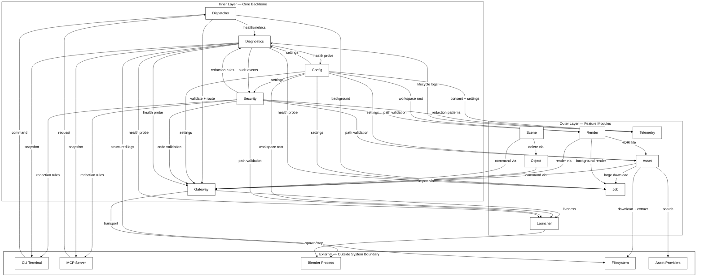

# Module: gateway (v1.7.0)

This document contains the source code for module `gateway` along with related and imported definitions from the `shared` module.

## File List

- [ARCHITECTURE.md](<ARCHITECTURE.md>)
- [modules/gateway/FRD.md](<modules/gateway/FRD.md>)
- [modules/gateway/pyproject.toml](<modules/gateway/pyproject.toml>)
- [modules/gateway/src/__init__.py](<modules/gateway/src/__init__.py>)
- [modules/gateway/src/agent_gateway_orchestrator.py](<modules/gateway/src/agent_gateway_orchestrator.py>)
- [modules/gateway/src/capabilities_code_execution.py](<modules/gateway/src/capabilities_code_execution.py>)
- [modules/gateway/src/capabilities_connection_maintenance.py](<modules/gateway/src/capabilities_connection_maintenance.py>)
- [modules/gateway/src/capabilities_connection_manager.py](<modules/gateway/src/capabilities_connection_manager.py>)
- [modules/gateway/src/capabilities_scene_queue.py](<modules/gateway/src/capabilities_scene_queue.py>)
- [modules/gateway/src/capabilities_transport_executor.py](<modules/gateway/src/capabilities_transport_executor.py>)
- [modules/gateway/src/root_gateway_container.py](<modules/gateway/src/root_gateway_container.py>)
- [modules/shared/src/common/__init__.py](<modules/shared/src/common/__init__.py>)
- [modules/shared/src/common/contract_command_catalog_protocol.py](<modules/shared/src/common/contract_command_catalog_protocol.py>)
- [modules/shared/src/common/taxonomy_command_catalog_constant.py](<modules/shared/src/common/taxonomy_command_catalog_constant.py>)
- [modules/shared/src/common/taxonomy_core_vo.py](<modules/shared/src/common/taxonomy_core_vo.py>)
- [modules/shared/src/common/taxonomy_domain_error.py](<modules/shared/src/common/taxonomy_domain_error.py>)
- [modules/shared/src/gateway/__init__.py](<modules/shared/src/gateway/__init__.py>)
- [modules/shared/src/gateway/contract_code_execution_protocol.py](<modules/shared/src/gateway/contract_code_execution_protocol.py>)
- [modules/shared/src/gateway/contract_code_validation_protocol.py](<modules/shared/src/gateway/contract_code_validation_protocol.py>)
- [modules/shared/src/gateway/contract_connection_protocol.py](<modules/shared/src/gateway/contract_connection_protocol.py>)
- [modules/shared/src/gateway/contract_event_protocol.py](<modules/shared/src/gateway/contract_event_protocol.py>)
- [modules/shared/src/gateway/contract_gateway_aggregate.py](<modules/shared/src/gateway/contract_gateway_aggregate.py>)
- [modules/shared/src/gateway/contract_maintenance_protocol.py](<modules/shared/src/gateway/contract_maintenance_protocol.py>)
- [modules/shared/src/gateway/contract_scene_queue_protocol.py](<modules/shared/src/gateway/contract_scene_queue_protocol.py>)
- [modules/shared/src/gateway/contract_transport_protocol.py](<modules/shared/src/gateway/contract_transport_protocol.py>)
- [modules/shared/src/gateway/taxonomy_gateway_constant.py](<modules/shared/src/gateway/taxonomy_gateway_constant.py>)
- [modules/shared/src/gateway/taxonomy_gateway_error.py](<modules/shared/src/gateway/taxonomy_gateway_error.py>)
- [modules/shared/src/gateway/taxonomy_gateway_event.py](<modules/shared/src/gateway/taxonomy_gateway_event.py>)
- [modules/shared/src/gateway/taxonomy_gateway_vo.py](<modules/shared/src/gateway/taxonomy_gateway_vo.py>)
- [modules/shared/src/gateway/utility_schema_helper.py](<modules/shared/src/gateway/utility_schema_helper.py>)
- [modules/shared/src/job/__init__.py](<modules/shared/src/job/__init__.py>)
- [modules/shared/src/job/taxonomy_job_error.py](<modules/shared/src/job/taxonomy_job_error.py>)
- [modules/shared/src/job/taxonomy_job_vo.py](<modules/shared/src/job/taxonomy_job_vo.py>)
- [modules/shared/src/security/__init__.py](<modules/shared/src/security/__init__.py>)
- [modules/shared/src/security/taxonomy_security_error.py](<modules/shared/src/security/taxonomy_security_error.py>)
- [modules/shared/src/security/taxonomy_security_vo.py](<modules/shared/src/security/taxonomy_security_vo.py>)
- [PRD.md](<PRD.md>)
- [pyproject.toml](<pyproject.toml>)
- [README.md](<README.md>)
- [RULES_AES.md](<RULES_AES.md>)

---

## File: ARCHITECTURE.md

````markdown
# Agentic Engineering System Architecture

## 1. Purpose

The Agentic Engineering System is a layered, AI-native architecture pattern. It keeps domain models stable, business logic readable, technical detail isolated, and layer boundaries explicit enough for both humans and AI agents to modify the system safely.

---

## 2. Workspace Organization

The architecture supports multi-language workspaces.

| Term               | Meaning                                                           |
| ------------------ | ----------------------------------------------------------------- |
| Project Workspaces | Project root containing all configuration and language members    |
| Workspace Member   | One self-contained crate, package, or module inside the workspace |
| Crates directory   | Rust workspace members                                            |
| Packages directory | TypeScript or JavaScript packages                                 |
| Modules directory  | Python modules or sub-projects                                    |

---

## 3. Naming Convention

File names must communicate three parts:

1. Layer as prefix
2. Concern as middle name
3. Role as suffix

The parts are joined by underscores, followed by the normal file extension for the language.

`layer_concern_role.rs/py/ts`

---

## 4. Vertical Slicing Folder Structure

The recommended folder structure follows this order:

#### Features member

_Example feature crate `crates|packages|modules/<name-features>/`_

```text
surface_<concern>_<role>.rs/py/ts                ← surface layer
capabilities_<concern>_<role>.rs/py/ts           ← capabilities layer
agent_<concern>_orchestrator.rs/py/ts            ← agent layer
```

Exceptions: `main.rs`, `lib.rs`, `mod.rs`, `__init__.py`, `index.ts`, `index.js`.

#### Shared member

`crates|packages|modules/shared/<common>or<domain-folder>`

```text
contract_<concern>_protocol.rs/py/ts             ← contract layer
contract_<concern>_aggregate.rs/py/ts            ← contract layer
taxonomy_<concern>_vo.rs/py/ts                   ← taxonomy layer
taxonomy_<concern>_event.rs/py/ts                ← taxonomy layer
taxonomy_<concern>_entity.rs/py/ts               ← taxonomy layer
taxonomy_<concern>_constant.rs/py/ts             ← taxonomy layer
utility_<concern>_<role>.rs/py/ts                ← utility layer
```

`shared` folder groups by domain. Use `shared/common/` for generic files.

---

## 5. Taxonomy Layer

### Purpose

Taxonomy is the domain foundation layer. It defines the stable language of the domain and must remain free from technical or behavioral concerns.

### Components

| Role         | Meaning                               |
| ------------ | ------------------------------------- |
| Value object | Immutable data concept                |
| Entity       | Stateful domain concept with identity |
| Event        | Immutable domain fact                 |
| Error        | Domain-level error                    |
| Constant     | Compile-time literal value            |

### Dependencies

Taxonomy depends on nothing.

### Special Rules

- Value objects and Constants may use all primitive types.
- Entities, Events, and Errors must use Value objects/Constants instead of primitive types (bool/str is an exception).
- Constants must be compile-time values.
- Taxonomy must not contain business rules, infrastructure, or imports from other layers.

---

## 6. Contract Layer

### Purpose

Contract defines the public behavior of the system without exposing implementation. It allows callers to depend on stable interfaces instead of concrete logic.

### Components

| Role      | Meaning                                                                                           |
| --------- | ------------------------------------------------------------------------------------------------- |
| Protocol  | Interface defining inbound behavior. It is implemented by Capabilities and consumed by the Agent. |
| Aggregate | Facade definition implemented by Agent, used by Surface to access feature behavior.               |

### Dependencies

Contract may depend on Taxonomy only.

### Special Rules

- Protocol defines behavior only without implementation.
- Aggregate hides Capabilities from Surface.

---

## 7. Utility Layer

### Purpose

Utility contains low-level technical mechanics. It exists so that Capabilities can remain clean and expressive.

### Role Naming

Utility role suffixes are unlimited. The role name is chosen based on demand and must describe the technical responsibility and concern of the file.

parser
splitter
trimmer
slugifier
sanitizer
normalizer
extractor
replacer
converter
counter
resolver
detector
builder
joiner
serializer
deserializer
encoder
decoder
hasher
generator
formatter
comparator
differ
matcher
checker
calculator
mapper
merger
grouper
sorter
deduplicator
printer

### Dependencies

Utility may depend only on Taxonomy.

### Technical Concern Examples

| Concern                 | Responsibility                                      |
| ----------------------- | --------------------------------------------------- |
| File discovery          | Walk directories, detect files, apply ignore        |
| External tool execution | Run linters, compilers, formatters, analyzers       |
| Parsing and matching    | Parse text, match patterns, extract structured data |
| Path normalization      | Normalize paths across platforms                    |
| System operations       | Handle process or environment mechanics             |

### Special Rules

- Utility must use stateless standalone functions only.
- Utility must not contain stateful objects, behavior definitions, or contract implementations.
- Utility must not make business decisions.
- Utility may perform technical operations if needed.
- Utility must not implement any contract.
- Utility role names may expand freely, but the layer must remain technical and standalone.
- Utility must use stateless standalone functions only.

---

## 8. Capabilities Layer

### Purpose

Capabilities contain the concrete implementation of the system's behavior. This layer encapsulates both **pure business logic** (computations, validations) and **external adaptations** (database access, third-party API calls, infrastructure mechanics). By hiding these implementations behind Contracts, the system keeps its behavior modular, swappable, and fully isolated from orchestration.

### Role Naming

#### Internal Examples

validator
assessor
calculator
resolver
classifier
selector
mapper
transformer
policy
enricher
evaluator
analyzer
scorer
grader
ranker
filter
checker
reviewer
approver
rejector

#### External Examples

repository
gateway
client
provider
fetcher
reader
writer
scanner
executor
publisher
subscriber
adapter
connector
uploader
downloader
sender
receiver
dispatcher
watcher
monitor

### Dependencies

- Capabilities may depend on Taxonomy, Contract, and Utility.
- Capabilities must not depend on or import other Capabilities.

### Concern Examples

Capabilities generally handle two types of concerns:

| Category                | Concern        | Responsibility                                 |
| ----------------------- | -------------- | ---------------------------------------------- |
| **Business Logic**      | Validation     | Check domain conditions or input correctness   |
|                         | Computation    | Calculate scores, totals, or derived values    |
|                         | Transformation | Map, filter, reduce, or reshape data           |
|                         | Resolution     | Apply rules and decide outcomes                |
|                         | Assessment     | Judge severity, compliance, grade, or quality  |
| **External Adaptation** | Repository     | Fetch or persist domain entities to a database |
|                         | Integration    | Communicate with third-party services or APIs  |
|                         | Provider       | Generate data from external systems            |

### Special Rules

- **No Inter-Capability Dependency:** Capabilities must never import or call other Capabilities directly. They are standalone execution units.
- **Pipeline Aggregation:** Multiple Capabilities (e.g., Capability A for data fetching, Capability B for business calculation) are designed to be composed into a sequential pipeline by the **Agent Layer**, not by themselves.
- **Shared Logic Extraction (DRY):** If multiple Capabilities require the same technical mechanics or functions, that logic must be extracted into a reusable standalone function in the **Utility Layer**. Capabilities must not duplicate technical code (Don't Repeat Yourself).
- **Contract Implementation:** Capabilities must implement the `protocol_` defined in the Contract Layer.
- **State Ownership:** Capabilities are the owners of business and technical state within their execution scope.
- **Utility Delegation:** Capabilities must call Utility standalone functions when low-level technical operations are required, passing their state/data as arguments.
- **No Orchestration:** Capabilities must not contain flow control (looping across capabilities, branching between capabilities, or error escalation policy). They execute their single responsibility and return a result.
- **No Domain Definition:** Capabilities must not define domain models (Entities, Value Objects); they only consume and produce Taxonomy.

---

## 9. Agent Layer

### Purpose

Agent coordinates multiple capabilities into executable flows. It controls sequence and movement, not business calculation.

### Allowed Role

The only Agent role is orchestrator.

### Dependencies

Agent may depend only on Taxonomy, Contract, and Utility.

### Allowed Flow Control

| Flow Type               | Purpose                                |
| ----------------------- | -------------------------------------- |
| Sequential execution    | Run steps in order                     |
| Looping                 | Process multiple items or events       |
| Branching               | Choose path based on result            |
| Error handling          | Recover, abort, continue, or escalate  |
| Timeout or cancellation | Stop long-running or asynchronous work |

### Special Rules

- Agent must depend on Contract, not concrete implementations.
- Agent must not use and must be completely ignorant of Capabilities implementations.
- Agent must not calculate business results.
- Agent must not define domain models.

---

## 10. Surface Layer

### Purpose

Surface is the outer boundary of the system. It handles user-facing or external-facing interaction and translates it into architectural actions.

### Allowed Roles

Surface roles include:

- command
- controller
- page
- view
- component
- router
- layout
- hook
- store
- action
- screen

### Surface Groups

| Group            | Roles                             | Dependencies                          | Rule                                            |
| ---------------- | --------------------------------- | ------------------------------------- | ----------------------------------------------- |
| Smart surfaces   | command, controller, page, router | Taxonomy, Contract Aggregate, Utility | May initiate feature behavior through aggregate |
| Utility surfaces | hook, store, action, screen       | Taxonomy, Contract Aggregate, Utility | Support smart surfaces but must not import smart surfaces |
| Passive surfaces | component, view, layout           | Taxonomy only                         | Presentation-only, no logic or orchestration    |

### Special Rules

- Smart surfaces must consume Contract Aggregates.
- Surfaces must not import Capabilities, Utility, or Agent directly.
- Surfaces must not contain business calculation or orchestration.

---

## 11. Root Layer

### Purpose

Root is the composition layer. It assembles the system by connecting concrete implementations to contracts and starting the application.

### Components

| Role      | Meaning                                                                           |
| --------- | --------------------------------------------------------------------------------- |
| Container | Wires one feature by connecting Capabilities to Contract protocols and aggregates |
| Entry     | Bootstraps the application and composes feature containers                        |

### Dependencies

Root may depend on all layers.

### Special Rules

- Root may instantiate and wire components.
- Root must not contain business logic.
- Root must not contain orchestration policy.
- Root must not contain technical parsing or user interface behavior.
````

---

## File: modules/gateway/FRD.md

```markdown
# FRD — Blender Gateway Feature

## Purpose

Single transport authority between application features and Blender runtime. Owns connection lifecycle, handshake, auth transport, protocol compatibility, liveness detection, reconnection, message framing, request/response correlation, payload limits, scene operation scheduling, raw command and raw code transport. Higher-level features never open sockets or talk to Blender directly.

## Scope

- Connection lifecycle to Blender
- Handshake and capability exchange
- Authentication transport
- Protocol version compatibility
- Heartbeat and liveness detection
- Reconnect with retry policy
- Message framing and encoding
- Request and response correlation
- Payload size limit enforcement
- Scene operation scheduler and queue
- Raw command transport
- Raw code execution transport
- Connection state reporting
- Transport-level error categorization
- Transport observability events

## Out of Scope

Action catalog, domain command schema, object/scene/render business rules, background task lifecycle, analytics, metrics storage, settings loading, process launching, code validation policy (security), asset download/provider comms, result artifact storage.

## Depends On

config (endpoint, timeout, payload, queue, heartbeat, retry settings), security policy (code validation, credential redaction), diagnostics (event + metric delivery).

## Provides To

dispatcher, object, scene, render, asset — any feature requiring Blender command transport or raw code execution.

## Functional Requirements

### FR-GWY-001: Establish Connection

- **Description**: Open transport channel to Blender, negotiate protocol, authenticate when required
- **Input**: Connection request (transport type, endpoint, timeout, protocol version, auth material if enabled)
- **Output**: Connection state (established, negotiated protocol, transport type, endpoint summary, capability summary)
- **Rules**: Gateway is sole feature allowed to open transport to Blender. Supported transports: local socket, stdin/stdout pipe. Establishment must complete within timeout. Handshake exchanges protocol version before any operation. Incompatible → rejected. Auth material transported only when auth enabled; never logged/echoed. Local endpoint default; remote requires config. One active connection per instance. Idempotent when already connected. State machine: disconnected → connecting → connected → reconnecting → failed → closed. Capability summary from handshake exposed when provided. Result includes redacted endpoint summary safe for diagnostics.
- **Edge Cases**: Blender not running, endpoint refused, timeout, auth failure, version mismatch, remote without auth, stale socket from previous session, unsupported transport, invalid endpoint config, bridge not enabled
- **Error Handling**: Connection error; auth error; protocol version mismatch error; config validation error

### FR-GWY-002: Maintain Connection

- **Description**: Keep connection healthy via liveness detection, controlled reconnection, accurate state reporting
- **Input**: None (steady state); liveness signals from heartbeat
- **Output**: Updated connection state (last liveness timestamp, reconnect count, last failure reason)
- **Rules**: Heartbeat at configured interval. Stale after configured consecutive missed heartbeats. Missed heartbeat during long-running execution must not immediately trigger reconnect unless transport closed or execution timeout exceeded. Reconnect: retry count with increasing backoff + jitter. Exhaustion → failed state, pending ops fail deterministically. Reconnect attempts emit events. State queryable at any time. Graceful disconnect idempotent. On connection loss: in-flight ops failed with connection error (not silently dropped); queued ops failed or preserved per policy. State transition events include redacted reason.
- **Edge Cases**: Blender crash, network interruption, heartbeat blocked by long execution, stale after sleep, disconnect during reconnect, repeated cycles, liveness recovered during backoff, delayed heartbeat response but transport alive, closed by Blender side
- **Error Handling**: Connection error on liveness loss; failed state after retry exhaustion; reconnect warnings via events; deterministic failure to in-flight + queued ops

### FR-GWY-003: Transport Request and Response

- **Description**: Move generic command messages to Blender and correlated responses back with framing, limits, timeouts enforced
- **Input**: Command message (operation class, payload, optional timeout override, tracking ID)
- **Output**: Response message (tracking ID, status, payload, transport metadata)
- **Rules**: Every request carries unique tracking ID. Every response correlated by tracking ID. Uncorrelated/orphan responses discarded safely + logged as transport warning. Deterministic framing (length-prefixed or delimiter). UTF-8 structured text encoding. Per-request timeout with optional override within bounds. Incoming/outgoing payload size enforced against configured limit. Oversized → clear transport error (not partial). Malformed → transport parse error. Sent during disconnected/reconnecting → fail fast with connection error (unless queue policy). Non-idempotent never retried by transport. Transport never interprets domain meaning. Metadata includes duration + payload size.
- **Edge Cases**: Malformed/partial frame, oversized request/response, missing tracking ID, duplicate response, response after timeout, connection lost mid-request, slow response near boundary, interleaved concurrent responses
- **Error Handling**: Timeout error; connection error; transport parse error; payload limit error; correlation warning for orphan responses

### FR-GWY-004: Serialize Scene-Mutating Operations

- **Description**: Serialize scene-mutating ops via queue to respect Blender main-thread constraints; read-only ops may bypass
- **Input**: Operation request (mutation classification, payload, optional priority hint)
- **Output**: Execution result (including queue wait duration)
- **Rules**: Scene-mutating ops pass through scheduler queue. Processed one at a time in deterministic order (default FIFO). Read-only ops may bypass the queue. Control-plane ops (status, liveness) never blocked by queue. Queue depth limit from config. Queue wait timeout from config. Depth limit reached → channel conflict error. Wait timeout exceeded → timeout error. Connection loss → pending queued ops fail deterministically. Graceful disconnect → fail or drain per policy. Queue state observable (depth + busy indicator). Long-running queued op must not silently block beyond configured execution timeout. Mutation classification provided by caller; gateway enforces, doesn't infer.
- **Edge Cases**: Queue full, wait timeout, disconnect while ops pending, long-running op blocking subsequent ops, enqueue after disconnect, concurrent producers, priority conflict, reclassification during wait, drain during shutdown
- **Error Handling**: Channel conflict error; timeout error; connection error; deterministic rejection (never silent drop)

### FR-GWY-005: Execute Raw Python Code

- **Description**: Transport raw code to Blender with security validation, execution timeout, bounded output handling
- **Input**: Raw code execution request (code text, optional timeout override, tracking ID)
- **Output**: Execution result (status, structured output, error detail, execution duration, truncation indicator)
- **Rules**: Raw code validated by security policy before transport — gateway never performs own validation. Execution timeout enforced (default + bounded override). Output structured + serializable; non-serializable → safe text representation or reject. Exceeding output size limit → truncation with indicator. Error detail: category, message, location hint (when provided by Blender). Raw code text not logged by default (redacted/hashed ref only). Gateway never creates/tracks/expires background task records — when submitted as background, only performs transport + returns task handoff ref. May reuse scene-mutating serialization when code mutates scene state. Duration reported. Security validation disabled override → audit warning.
- **Edge Cases**: Syntax error, runtime failure, timeout, Blender crash during execution, oversized/non-serializable output, security violation detected, validation disabled override, code rejected by size limit, connection lost, background task handoff
- **Error Handling**: Security violation error (delegated); timeout error; execution error (runtime failure); connection error; truncation indicator for oversized but successful output

## Error Categories

- connection error — failed/refused/lost
- timeout error — transport/execution/queue wait exceeded
- protocol version mismatch — incompatible versions
- authentication error — transport auth failed
- channel conflict — queue depth limit/serialization contention
- security violation — code validation failed (delegated)
- transport parse error — malformed frame/unparseable response
- payload limit error — oversized request/response

## Events

- connection established (handshake complete)
- connection lost (dropped/stale)
- reconnection attempt (count + backoff)
- connection failed (retry exhausted)
- operation enqueued (accepted into scheduler queue)
- operation rejected (depth limit, wait timeout, or connection loss)
- raw code execution completed (status, duration, truncation)

Payloads: category, connection state before/after, tracking ID, queue depth, duration, redacted reason. Never: raw code, auth material, full payloads, sensitive filesystem refs.

## Configuration Keys

| Key | Description | Default |
|---|---|---|
| blender_host | Endpoint host | Local |
| blender_port | Endpoint port | Configured bridge port |
| transport_timeout | Default request/response timeout | Conservative |
| payload_limit | Max request/response payload size | Conservative |
| queue_depth | Max scene-mutating ops in queue | 50 |
| queue_wait_timeout | Max queue wait before rejection | Conservative |
| heartbeat_interval | Liveness check frequency | 10s |
| heartbeat_failure_threshold | Missed heartbeats before stale | 3 |
| reconnect_retry_count | Max reconnection attempts | 3 |
| reconnect_backoff_policy | Delay progression | 1s, 2s, 4s + jitter |
| authentication_enabled | Require auth material | Enabled for non-local |
| protocol_version | Advertised version | Current supported |
| execution_timeout | Default raw code timeout | 30s |
| output_size_limit | Max execution output | Conservative |

## QA Checklist

- [ ] Connection established with handshake + protocol check
- [ ] Incompatible protocol → rejected
- [ ] Auth material only when auth enabled; never in logs/diagnostics
- [ ] Timeout respected; idempotent when already connected
- [ ] State machine: disconnected→connecting→connected→reconnecting→failed→closed
- [ ] Heartbeat at interval; stale after threshold
- [ ] Missed heartbeat during long execution doesn't falsely trigger reconnect
- [ ] Reconnect with retry + backoff; exhaustion → failed state
- [ ] Pending ops fail deterministically on connection loss
- [ ] Graceful disconnect idempotent
- [ ] Request/response correlation with tracking ID
- [ ] Orphan response → transport warning
- [ ] Transport timeout per request; oversized → payload limit error
- [ ] Malformed → transport parse error
- [ ] Scene-mutating ops serialized via queue; FIFO
- [ ] Read-only + control-plane ops bypass queue
- [ ] Queue depth limit → channel conflict error
- [ ] Queue wait timeout → timeout error
- [ ] Queued ops fail deterministically on disconnect
- [ ] Queue state observable
- [ ] Raw code validated by security; gateway never validates itself
- [ ] Execution timeout enforced; output truncated on size limit
- [ ] Non-serializable output handled safely
- [ ] Raw code text not logged by default
- [ ] Background task handoff → task ref, no gateway-owned lifecycle
- [ ] All transport events emitted
```

---

## File: modules/gateway/pyproject.toml

```toml
[project]
name = "blender-arwaky-gateway"
version = "1.7.0"
description = "BlenderArwaky gateway orchestration module"
requires-python = ">=3.10"
license = {text = "MIT"}

[build-system]
requires = ["setuptools>=61.0", "wheel"]
build-backend = "setuptools.build_meta"

[tool.setuptools]
packages = ["."]
```

---

## File: modules/gateway/src/__init__.py

```python
from .agent_gateway_orchestrator import GatewayOrchestrator
from .capabilities_code_execution import CodeExecutionAdapter, CodeExecutionExecutor
from .capabilities_connection_maintenance import MaintenanceExecutor
from .capabilities_connection_manager import BlenderConnection, ConnectionExecutor
from .capabilities_scene_queue import OperationQueue, OperationState, SceneQueueExecutor
from .capabilities_transport_executor import BlenderCommandAdapter, TransportExecutor
from .root_gateway_container import GatewayContainer, create_gateway_feature

__all__ = [
    "BlenderCommandAdapter",
    "BlenderConnection",
    "CodeExecutionAdapter",
    "CodeExecutionExecutor",
    "ConnectionExecutor",
    "GatewayContainer",
    "GatewayOrchestrator",
    "MaintenanceExecutor",
    "OperationQueue",
    "OperationState",
    "SceneQueueExecutor",
    "TransportExecutor",
    "create_gateway_feature",
]
```

---

## File: modules/gateway/src/agent_gateway_orchestrator.py

```python
"""Gateway orchestrator — Aggregate facade coordinating gateway protocols.

FR-GWY: Coordinates connection, maintenance, transport, scene queue, and code execution.
"""

from __future__ import annotations

import logging

from modules.shared.src.gateway.contract_code_execution_protocol import (
    CodeExecutionProtocol,
)
from modules.shared.src.gateway.contract_connection_protocol import (
    ConnectionProtocol,
)
from modules.shared.src.gateway.contract_gateway_aggregate import IGatewayAggregate
from modules.shared.src.gateway.contract_maintenance_protocol import (
    ConnectionMaintenanceProtocol,
)
from modules.shared.src.gateway.contract_scene_queue_protocol import (
    SceneQueueProtocol,
)
from modules.shared.src.gateway.contract_transport_protocol import (
    TransportProtocol,
)
from modules.shared.src.gateway.taxonomy_gateway_vo import (
    CodeExecutionOutcomeVO,
    CodeExecutionVO,
    ConnectionOutcomeVO,
    ConnectionState,
    ConnectionStatusVO,
    QueueStatusVO,
    SceneOperationOutcomeVO,
    SceneOperationVO,
    TransportMessageVO,
    TransportOutcomeVO,
)

logger = logging.getLogger("BlenderMCPServer")


class GatewayOrchestrator(IGatewayAggregate):
    """Aggregate facade for the Gateway feature."""

    # ─── Block 1: Class Definition & Constructor ──────────────

    def __init__(
        self,
        connection: ConnectionProtocol,
        maintenance: ConnectionMaintenanceProtocol,
        transport: TransportProtocol,
        scene_queue: SceneQueueProtocol,
        code_executor: CodeExecutionProtocol,
    ) -> None:
        self._connection = connection
        self._maintenance = maintenance
        self._transport = transport
        self._scene_queue = scene_queue
        self._code_executor = code_executor

    # ─── Block 2: Protocol Method Implementation ─────────────

    def establish_connection(self) -> ConnectionOutcomeVO:
        """FR-GWY-001: Establish connection and wire transport layer."""
        logger.info("Establishing gateway connection")
        result = self._connection.establish_connection()

        if result.state == ConnectionState.CONNECTED:
            self._maintenance.set_state(result.state)

        return result

    def disconnect(self) -> None:
        """FR-GWY-002: Graceful disconnect."""
        logger.info("Disconnecting gateway")
        self._connection.disconnect()
        self._maintenance.set_state(ConnectionState.CLOSED)

    def get_connection_status(self) -> ConnectionStatusVO:
        """FR-GWY-002: Query connection state."""
        return self._maintenance.get_connection_status()

    def send_heartbeat(self) -> None:
        """FR-GWY-002: Send heartbeat."""
        self._maintenance.send_heartbeat()

    def attempt_reconnect(self) -> ConnectionStatusVO:
        """FR-GWY-002: Attempt reconnection."""
        return self._maintenance.attempt_reconnect()

    def send_request(self, request: TransportMessageVO) -> TransportOutcomeVO:
        """FR-GWY-003: Send transport request and receive response."""
        logger.debug("Sending transport request: %s", request.tracking_id)
        return self._transport.send_request(request)

    def enqueue_scene_operation(self, operation: SceneOperationVO) -> SceneOperationOutcomeVO:
        """FR-GWY-004: Enqueue scene operation."""
        return self._scene_queue.enqueue_operation(operation)

    def get_queue_status(self) -> QueueStatusVO:
        """FR-GWY-004: Get queue status."""
        return self._scene_queue.get_queue_status()

    def execute_code(self, request: CodeExecutionVO) -> CodeExecutionOutcomeVO:
        """FR-GWY-005: Execute raw Python code."""
        logger.debug("Executing code: tracking_id=%s", request.tracking_id)
        return self._code_executor.execute_code(request)

    # ─── Block 3: Dunder Methods, Factories & Helpers ──────────

    def __repr__(self) -> str:
        return (
            f"GatewayOrchestrator("
            f"connection={self._connection is not None}, "
            f"maintenance={self._maintenance is not None}, "
            f"transport={self._transport is not None}, "
            f"scene_queue={self._scene_queue is not None}, "
            f"code_executor={self._code_executor is not None}"
            f")"
        )
```

---

## File: modules/gateway/src/capabilities_code_execution.py

```python
"""Capability: Code execution with security validation and transport delegation.

FR-GWY-005: Execute Raw Python Code
- Validates code via security policy feature before transport
- Enforces execution timeout
- Truncates oversized output with truncation indicator
- Does not manage background task lifecycle
- Delegates security validation to gateway-local CodeValidationProtocol (wired to security validator)
- Delegates code transport to gateway transport feature (TransportProtocol)

Contains CodeExecutionAdapter (asyncio-based, ICodeExecutionProtocol)
and CodeExecutionExecutor (sync socket-based, CodeExecutionProtocol).
"""

from __future__ import annotations

import asyncio
import logging
import time
import uuid
from dataclasses import dataclass, field

from modules.shared.src.gateway.contract_code_execution_protocol import (
    CodeExecutionProtocol,
    ICodeExecutionProtocol,
)
from modules.shared.src.gateway.contract_code_validation_protocol import (
    CodeValidationProtocol,
)
from modules.shared.src.gateway.contract_connection_protocol import (
    IBlenderConnectionProtocol,
)
from modules.shared.src.gateway.contract_event_protocol import (
    IEventPublisher,
)
from modules.shared.src.gateway.contract_transport_protocol import (
    TransportProtocol,
)
from modules.shared.src.gateway.taxonomy_gateway_constant import (
    DEFAULT_EXECUTION_TIMEOUT_MS,
    MAX_EXECUTION_OUTPUT_BYTES,
)
from modules.shared.src.gateway.taxonomy_gateway_error import (
    ConnectionClosedError,
    ExecutionTimeoutError,
    SecurityViolationError,
    TimeoutError,
)
from modules.shared.src.gateway.taxonomy_gateway_event import (
    CodeExecuted,
)
from modules.shared.src.gateway.taxonomy_gateway_vo import (
    CodeExecutionOutcomeVO,
    CodeExecutionVO,
    ExecutionResult,
    ExecutionStatus,
    TaskState,
    TransportMessageVO,
    TransportOutcomeVO,
)
from modules.shared.src.security.taxonomy_security_vo import (
    CodeValidationVO,
)

logger = logging.getLogger("BlenderMCPServer")


class CodeExecutionAdapter(ICodeExecutionProtocol):
    """Async code execution adapter delegating to connection and events."""

    def __init__(
        self,
        connection_port: IBlenderConnectionProtocol,
        event_publisher: IEventPublisher,
        default_timeout_ms: float = DEFAULT_EXECUTION_TIMEOUT_MS,
        max_output_bytes: int = MAX_EXECUTION_OUTPUT_BYTES,
    ) -> None:
        self._connection = connection_port
        self._event_publisher = event_publisher
        self._default_timeout_ms = default_timeout_ms
        self._max_output_bytes = max_output_bytes

    async def execute_blender_code(
        self,
        code: str,
        request_id: str | None = None,
    ) -> ExecutionResult:
        start = time.monotonic()
        try:
            result = await asyncio.wait_for(
                self._connection.send_command(
                    action="execute_code",
                    params={"code": code},
                    request_id=request_id,
                    timeout_ms=self._default_timeout_ms,
                ),
                timeout=self._default_timeout_ms / 1000.0,
            )
            elapsed_ms = (time.monotonic() - start) * 1000
            data = result.data if result.data is not None else ""
            truncated = False
            if isinstance(data, str) and len(data.encode("utf-8")) > self._max_output_bytes:
                data = data[: self._max_output_bytes] + "\n...[truncated]"
                truncated = True
            exec_result = ExecutionResult(
                status=ExecutionStatus("success"),
                data=data,
                truncated=truncated,
                execution_time_ms=elapsed_ms,
                request_id=request_id,
            )
            await self._event_publisher.publish(
                CodeExecuted(
                    request_id=request_id or "",
                    execution_time_ms=elapsed_ms,
                    truncated=truncated,
                )
            )
            return exec_result
        except asyncio.TimeoutError:
            elapsed_ms = (time.monotonic() - start) * 1000
            raise ExecutionTimeoutError(
                timeout_ms=self._default_timeout_ms,
                details={"request_id": request_id},
            ) from None
        except ConnectionClosedError:
            raise
        except Exception as e:
            elapsed_ms = (time.monotonic() - start) * 1000
            raise RuntimeError(f"Code execution failed: {e}") from e

    async def execute_task(self, _task_id: str, _code: str, _request_id: str | None = None) -> ExecutionResult:
        raise RuntimeError("Task lifecycle management belongs to the Job feature")

    async def create_task(self, _request_id: str | None = None) -> str:
        raise RuntimeError("Task lifecycle management belongs to the Job feature")

    async def get_task(self, _task_id: str) -> object:
        raise RuntimeError("Task lifecycle management belongs to the Job feature")

    async def poll_task_result(self, _task_id: str, _request_id: str | None = None) -> object:
        raise RuntimeError("Task lifecycle management belongs to the Job feature")

    async def cancel_async_task(self, _task_id: str, _request_id: str | None = None) -> object:
        raise RuntimeError("Task lifecycle management belongs to the Job feature")

    def cleanup_expired(self) -> int:
        return 0

    def __repr__(self) -> str:
        return f"CodeExecutionAdapter(timeout={self._default_timeout_ms}ms)"


@dataclass
class TaskEntry:
    task_id: str
    state: TaskState
    result: ExecutionResult | None = None
    request_id: str | None = None
    created_at: float = field(default_factory=time.monotonic)
    completed_at: float | None = None
    cancel_requested: bool = False


class CodeExecutionExecutor(CodeExecutionProtocol):
    """Concrete implementation for raw Python code execution.

    FR-GWY-005: Validates via security policy before transport. Enforces timeout.
    Truncates oversized output. Does not manage background task lifecycle.
    Delegates security validation to CodeValidationProtocol (gateway-local).
    Delegates code transport to TransportProtocol.
    """

    def __init__(
        self,
        security_policy: CodeValidationProtocol | None = None,
        transport: TransportProtocol | None = None,
        max_output_bytes: int = 1_048_576,
        execution_timeout_seconds: float = 30.0,
    ) -> None:
        self._security_policy: CodeValidationProtocol | None = security_policy
        self._transport: TransportProtocol | None = transport
        self._max_output_bytes: int = max_output_bytes
        self._execution_timeout_seconds: float = execution_timeout_seconds

    def execute_code(self, request: CodeExecutionVO) -> CodeExecutionOutcomeVO:
        if self._security_policy is None:
            return CodeExecutionOutcomeVO(
                status="error",
                error_message="Security policy not configured",
            )
        if self._transport is None:
            return CodeExecutionOutcomeVO(
                status="error",
                error_message="Transport not configured",
            )
        start_time = time.time()
        try:
            self._validate_code(request)
        except SecurityViolationError:
            logger.error("Code execution blocked by security policy")
            raise
        timeout = request.timeout_override_seconds or self._execution_timeout_seconds
        try:
            outcome = self._execute_via_transport(request, timeout)
            duration_ms = (time.time() - start_time) * 1000
            output = outcome.payload.decode("utf-8") if outcome.payload else ""
            truncated = False
            if len(output.encode("utf-8")) > self._max_output_bytes:
                output = output[: self._max_output_bytes]
                truncated = True
            logger.debug(
                "Code execution complete: status=%s, %.1fms, truncated=%s",
                outcome.status,
                duration_ms,
                truncated,
            )
            return CodeExecutionOutcomeVO(
                status=outcome.status,
                output=output[:500],
                truncated=truncated,
                duration_ms=duration_ms,
                error_category=outcome.error,
                error_message=outcome.error,
            )
        except TimeoutError:
            logger.error("Code execution timed out after %.1fs", timeout)
            return CodeExecutionOutcomeVO(
                status="timeout",
                error_message=f"Execution timed out after {timeout}s",
                duration_ms=(time.time() - start_time) * 1000,
            )
        except Exception as e:
            logger.error("Code execution failed: %s", e)
            return CodeExecutionOutcomeVO(
                status="error",
                error_category="runtime",
                error_message=str(e),
                duration_ms=(time.time() - start_time) * 1000,
            )

    def _validate_code(self, request: CodeExecutionVO) -> None:
        security_request = CodeValidationVO(
            code_text=request.code,
            max_code_size=100_000,
            strict_mode=True,
            execution_context="gateway_code_execution",
        )
        result = self._security_policy.validate_code(security_request)
        if not result.allowed:
            violation_descriptions = "; ".join(v.description for v in result.violations)
            raise SecurityViolationError(f"Code validation failed: {violation_descriptions}")

    def _execute_via_transport(self, request: CodeExecutionVO, timeout_seconds: float) -> TransportOutcomeVO:
        tracking_id = request.tracking_id or str(uuid.uuid4())
        transport_request = TransportMessageVO(
            tracking_id=tracking_id,
            operation_class="code_execution",
            payload=request.code.encode("utf-8"),
            timeout_override_seconds=timeout_seconds,
        )
        return self._transport.send_request(transport_request)

    def __repr__(self) -> str:
        return (
            f"CodeExecutionExecutor(security={self._security_policy!r}, "
            f"transport={self._transport!r}, "
            f"max_output={self._max_output_bytes}, "
            f"timeout={self._execution_timeout_seconds})"
        )
```

---

## File: modules/gateway/src/capabilities_connection_maintenance.py

```python
"""Capability: Connection maintenance and reconnect logic.

FR-GWY-002: Maintain connection with heartbeat, liveness detection,
and configurable retry with exponential backoff and jitter.
"""

from __future__ import annotations

import logging
import time
from collections.abc import Callable

from modules.shared.src.gateway.contract_maintenance_protocol import (
    ConnectionMaintenanceProtocol,
)
from modules.shared.src.gateway.taxonomy_gateway_vo import (
    ConnectionState,
    ConnectionStatusVO,
)

logger = logging.getLogger("BlenderMCPServer")


class MaintenanceExecutor(ConnectionMaintenanceProtocol):
    """Concrete capability executor for gateway connection maintenance."""

    # ─── Block 1: Class Definition & Constructor ──────────────

    def __init__(
        self,
        max_retries: int = 3,
        base_backoff_seconds: float = 1.0,
        max_backoff_seconds: float = 16.0,
        reconnect_fn: Callable[[], object] | None = None,
    ) -> None:
        self._state: ConnectionState = ConnectionState.DISCONNECTED
        self._last_heartbeat_timestamp: float | None = None
        self._reconnect_attempts: int = 0
        self._last_failure_reason: str | None = None
        self._active_operation: bool = False
        self._reconnect_fn: Callable[[], object] | None = reconnect_fn
        self._max_retries: int = max_retries
        self._base_backoff: float = base_backoff_seconds
        self._max_backoff: float = max_backoff_seconds

    # ─── Block 2: Protocol Method Implementation ─────────────

    def get_connection_status(self) -> ConnectionStatusVO:
        return ConnectionStatusVO(
            state=self._state,
            last_heartbeat_timestamp=self._last_heartbeat_timestamp,
            reconnect_attempts=self._reconnect_attempts,
            last_failure_reason=self._last_failure_reason,
            active_operation_in_progress=self._active_operation,
        )

    def send_heartbeat(self) -> None:
        if self._state not in (ConnectionState.CONNECTED, ConnectionState.RECONNECTING):
            logger.debug("Cannot send heartbeat — not connected")
            return
        self._last_heartbeat_timestamp = time.time()
        logger.debug("Heartbeat sent")

    def attempt_reconnect(self) -> ConnectionStatusVO:
        if self._state == ConnectionState.CONNECTED or self._reconnect_attempts >= self._max_retries:
            self._reconnect_attempts = 0
        self._reconnect_attempts += 1
        self._state = ConnectionState.RECONNECTING
        logger.warning(
            "Reconnection attempt %d/%d",
            self._reconnect_attempts,
            self._max_retries,
        )
        backoff = self._calculate_backoff()
        logger.debug("Applying %.1fs backoff before reconnect", backoff)
        import threading
        if threading.current_thread().name != "MainThread":
            time.sleep(min(backoff, 0.1))
        try:
            if self._reconnect_fn is not None:
                outcome = self._reconnect_fn()
                if outcome is None or getattr(outcome, "state", None) != ConnectionState.CONNECTED:
                    reason = getattr(outcome, "error", None) if outcome is not None else "reconnect returned None"
                    raise RuntimeError(f"Reconnect attempt did not establish a connection: {reason}")
            self._state = ConnectionState.CONNECTED
            self._last_failure_reason = None
            logger.info("Reconnection successful on attempt %d", self._reconnect_attempts)
        except Exception as e:
            self._last_failure_reason = str(e)
            self._state = ConnectionState.FAILED
            logger.warning("Reconnection failed: %s", e)
            if self._reconnect_attempts >= self._max_retries:
                logger.error(
                    "Retry exhaustion after %d attempts — connection in failed state",
                    self._reconnect_attempts,
                )
        return self.get_connection_status()

    def set_state(self, state: ConnectionState | None) -> None:
        self._state = state if state is not None else ConnectionState.CLOSED

    # ─── Block 3: Dunder Methods, Factories & Helpers ──────────

    def set_active_operation(self, active: bool) -> None:
        self._active_operation = active

    def _calculate_backoff(self) -> float:
        exponential = self._base_backoff * (2 ** (self._reconnect_attempts - 1))
        capped = min(exponential, self._max_backoff)
        jitter = ((time.time_ns() % 1000) / 1000.0) * (capped * 0.5)
        return capped + jitter

    def __repr__(self) -> str:
        return f"MaintenanceExecutor(state={self._state.value}, retries={self._reconnect_attempts})"
```

---

## File: modules/gateway/src/capabilities_connection_manager.py

```python
"""Capability: Blender connection lifecycle — asyncio and sync implementations.

FR-GWY-001: Establish Connection
- Opens socket or stdio pipe channel
- Performs handshake and protocol version negotiation
- Authenticates when required
- Idempotent when already connected
- Delegates transport messaging to TransportProtocol
- Uses configured auth material for authentication

Contains BlenderConnection (asyncio stream-based, IBlenderConnectionProtocol)
and ConnectionExecutor (sync socket-based, ConnectionProtocol).
"""

from __future__ import annotations

import asyncio
import json
import logging
import socket as _socket
import struct
import time
import uuid
from contextlib import suppress

from modules.shared.src.gateway.contract_connection_protocol import (
    ConnectionProtocol,
    IBlenderConnectionProtocol,
)
from modules.shared.src.gateway.contract_event_protocol import (
    IEventPublisher,
)
from modules.shared.src.gateway.contract_transport_protocol import (
    TransportProtocol,
)
from modules.shared.src.gateway.taxonomy_gateway_constant import (
    CONNECTION_STATE_CLOSED,
    CONNECTION_STATE_CONNECTED,
    CONNECTION_STATE_DISCONNECTED,
    CONNECTION_STATE_FAILED,
    CONNECTION_STATE_RECONNECTING,
    DEFAULT_PROTOCOL_VERSION,
    HEARTBEAT_FAILURE_THRESHOLD,
    HEARTBEAT_INTERVAL_SECONDS,
)
from modules.shared.src.gateway.taxonomy_gateway_error import (
    AuthenticationError,
    BlenderConnectionExhausted,
    BlenderConnectionFailure,
    ConnectionClosedError,
    ConnectionConfigError,
    ProtocolVersionMismatchError,
    TransportParseError,
    VersionMismatchError,
)
from modules.shared.src.gateway.taxonomy_gateway_event import (
    ConnectionEstablished,
    ConnectionLost,
)
from modules.shared.src.gateway.taxonomy_gateway_vo import (
    CommandResult,
    ConnectionConfig,
    ConnectionConfigVO,
    ConnectionOutcomeVO,
    ConnectionState,
    ConnectionStatus,
    TransportMessageVO,
)

logger = logging.getLogger("BlenderMCPServer")


class BlenderConnection(IBlenderConnectionProtocol):
    """Asyncio-based persistent connection to Blender addon."""

    # ─── Block 1: Class Definition & Constructor ──────────────

    def __init__(self, event_publisher: IEventPublisher) -> None:
        self._event_publisher = event_publisher
        self._config: ConnectionConfig | None = None
        self._host: str = "localhost"
        self._port: int = 9876
        self._reader: asyncio.StreamReader | None = None
        self._writer: asyncio.StreamWriter | None = None
        self._state: ConnectionState = CONNECTION_STATE_DISCONNECTED
        self._active_operation: bool = False
        self._protocol_version: str | None = DEFAULT_PROTOCOL_VERSION
        self._last_error: str | None = None
        self._reconnect_attempts: int = 0
        self._session_id: str | None = None
        self._active_file_path: str | None = None
        self._active_directory: str | None = None
        self._last_heartbeat_at: float | None = None
        self._heartbeat_task: asyncio.Task[None] | None = None
        self._consecutive_failures: int = 0
        self._lock: asyncio.Lock = asyncio.Lock()

    # ─── Block 2: Protocol Method Implementation ─────────────

    async def connect(self, config: ConnectionConfig) -> ConnectionStatus:
        self._config = config
        self._host = config.host or "localhost"
        self._port = config.port or 9876

        if config.require_auth_for_remote and self._is_remote() and not config.auth_token:
            raise ConnectionConfigError(
                message="Remote connection requires authentication token",
                details={"host": self._host},
            )

        max_attempts = config.reconnect_max_attempts if hasattr(config, "reconnect_max_attempts") else 3
        base_delay = config.reconnect_base_delay_seconds if hasattr(config, "reconnect_base_delay_seconds") else 1.0
        max_delay = config.reconnect_max_delay_seconds if hasattr(config, "reconnect_max_delay_seconds") else 4.0

        for attempt in range(max_attempts):
            try:
                await self._establish_stream()
                await self._perform_handshake(config)
                await self._authenticate(config)

                self._state = CONNECTION_STATE_CONNECTED
                self._reconnect_attempts = attempt + 1
                self._consecutive_failures = 0
                self._last_heartbeat_at = time.monotonic()
                self._start_heartbeat(config)

                await self._event_publisher.publish(
                    ConnectionEstablished(
                        host=self._host,
                        port=self._port,
                        transport_type=config.transport_type,
                    )
                )

                status = ConnectionStatus(
                    state=CONNECTION_STATE_CONNECTED,
                    host=self._host,
                    port=self._port,
                    transport_type=config.transport_type,
                    protocol_version=self._protocol_version,
                    reconnect_attempts=self._reconnect_attempts,
                    session_id=self._session_id,
                    active_file_path=self._active_file_path,
                    active_directory=self._active_directory,
                )
                logger.info("Connected to Blender at %s:%d", self._host, self._port)
                return status

            except (VersionMismatchError, AuthenticationError, ConnectionConfigError):
                await self._close_stream()
                self._state = CONNECTION_STATE_FAILED
                raise

            except Exception as e:
                self._state = CONNECTION_STATE_FAILED
                self._last_error = str(e)
                logger.warning(
                    "Connection attempt %d/%d failed: %s",
                    attempt + 1,
                    max_attempts,
                    e,
                )
                await self._close_stream()
                if attempt < max_attempts - 1:
                    base = min(base_delay * (2**attempt), max_delay)
                    jitter = (time.monotonic() % 0.5) * base
                    delay = base + jitter
                    logger.debug("Waiting %.1f seconds before reconnect attempt %d", delay, attempt + 2)
                    await asyncio.sleep(delay)

        self._state = CONNECTION_STATE_FAILED
        raise BlenderConnectionExhausted(
            attempts=max_attempts,
            details={"host": self._host, "port": self._port},
        )

    async def disconnect(self) -> None:
        await self._stop_heartbeat()
        await self._close_stream()
        old_state = self._state
        self._state = CONNECTION_STATE_CLOSED
        if old_state != CONNECTION_STATE_CLOSED:
            await self._event_publisher.publish(ConnectionLost(reason="closed"))
            logger.info("Disconnected from Blender (state=%s)", CONNECTION_STATE_CLOSED)

    async def is_connected(self) -> bool:
        try:
            return not (self._writer is None or self._writer.closed)
        except Exception as e:
            logger.debug("is_connected check failed: %s", e)
            return False

    async def send_command(
        self,
        action: str,
        params: dict | None = None,
        request_id: str | None = None,
        timeout_ms: float | None = None,
    ) -> CommandResult:
        if self._writer is None or self._writer.closed:
            raise ConnectionClosedError(details={"reason": "no_writer"})
        try:
            payload = {
                "type": "command",
                "request_id": request_id or "",
                "action": action,
            }
            if params:
                payload["params"] = params
            json_bytes = json.dumps(payload).encode("utf-8")
            header = struct.pack("!I", len(json_bytes))
            try:
                self._writer.write(header + json_bytes)
                await self._writer.drain()
            except (BrokenPipeError, OSError) as e:
                raise ConnectionClosedError(details={"reason": "drain_failed", "error": str(e)}) from e
            response = await self._receive_response(timeout_ms)
            resp_dict = json.loads(response.decode("utf-8"))
            if resp_dict.get("status") == "error":
                raise BlenderConnectionFailure(
                    message=resp_dict.get("message", "Command failed"),
                    details={"action": action},
                )
            return CommandResult(
                status="success",
                data=resp_dict.get("result", {}),
                request_id=request_id,
            )
        except ConnectionClosedError:
            raise
        except Exception as e:
            if isinstance(e, (AuthenticationError, VersionMismatchError)):
                raise
            raise BlenderConnectionFailure(
                message=f"Command '{action}' failed: {e}",
                details={"action": action},
            ) from e

    async def receive_full_response(self, _buffer_size: int = 8192) -> bytes:
        if self._reader is None:
            raise ConnectionClosedError(details={"reason": "no_reader"})
        header = await self._reader.readexactly(4)
        msg_len = struct.unpack("!I", header)[0]
        payload = await self._reader.readexactly(msg_len)
        return payload

    # ─── Block 3: Dunder Methods, Factories & Helpers ──────────

    def set_active_operation_in_progress(self, active: bool) -> None:
        self._active_operation = active

    def __repr__(self) -> str:
        return f"BlenderConnection(host={self._host!r}, port={self._port}, state={self._state})"

    async def _establish_stream(self) -> None:
        try:
            self._reader, self._writer = await asyncio.wait_for(
                asyncio.open_connection(self._host, self._port),
                timeout=self._config.connection_timeout_seconds if self._config else 30.0,
            )
        except asyncio.TimeoutError:
            raise ConnectionConfigError(
                message=f"Connection to {self._host}:{self._port} timed out",
                details={"host": self._host, "port": self._port},
            ) from None

    async def _perform_handshake(self, config: ConnectionConfig) -> None:
        request_id = str(time.monotonic())
        payload = {
            "type": "handshake",
            "request_id": request_id,
            "protocol_version": config.protocol_version or DEFAULT_PROTOCOL_VERSION,
        }
        json_bytes = json.dumps(payload).encode("utf-8")
        header = struct.pack("!I", len(json_bytes))
        self._writer.write(header + json_bytes)
        await self._writer.drain()
        response = await self._receive_response()
        resp_dict = json.loads(response.decode("utf-8"))
        if resp_dict.get("status") == "version_mismatch":
            raise VersionMismatchError(
                expected=config.protocol_version or DEFAULT_PROTOCOL_VERSION,
                actual=resp_dict.get("protocol_version", ""),
            )
        if resp_dict.get("status") != "ok":
            raise ConnectionConfigError(
                message=f"Handshake failed: {resp_dict.get('message', 'unknown')}",
            )
        self._protocol_version = resp_dict.get("protocol_version", DEFAULT_PROTOCOL_VERSION)
        server_major = self._parse_major(config.protocol_version or DEFAULT_PROTOCOL_VERSION)
        addon_major = self._parse_major(self._protocol_version)
        if server_major != addon_major:
            raise VersionMismatchError(
                expected=config.protocol_version or DEFAULT_PROTOCOL_VERSION,
                actual=self._protocol_version,
            )
        self._session_id = resp_dict.get("result", {}).get("session_id")
        self._active_file_path = resp_dict.get("result", {}).get("active_file_path")
        self._active_directory = resp_dict.get("result", {}).get("active_directory")

    async def _authenticate(self, config: ConnectionConfig) -> None:
        if not config.auth_token:
            return
        payload = {
            "type": "auth",
            "request_id": str(time.monotonic()),
            "token": config.auth_token,
        }
        json_bytes = json.dumps(payload).encode("utf-8")
        header = struct.pack("!I", len(json_bytes))
        self._writer.write(header + json_bytes)
        await self._writer.drain()
        try:
            response = await self._receive_response()
            resp_dict = json.loads(response.decode("utf-8"))
            if resp_dict.get("status") == "auth_failed":
                raise AuthenticationError(
                    message="Invalid authentication token",
                    details={"host": self._host},
                )
        except ConnectionClosedError:
            raise AuthenticationError(
                message="Authentication connection lost",
                details={"host": self._host},
            ) from None

    async def _receive_response(self, timeout_ms: float | None = None) -> bytes:
        timeout_s = timeout_ms / 1000.0 if timeout_ms else 30.0
        try:
            header = await asyncio.wait_for(self._reader.readexactly(4), timeout=timeout_s)
        except asyncio.TimeoutError:
            raise ConnectionClosedError(details={"reason": "response_timeout"}) from None
        except asyncio.IncompleteReadError:
            raise ConnectionClosedError(details={"reason": "connection_dropped"}) from None
        msg_len = struct.unpack("!I", header)[0]
        try:
            payload = await asyncio.wait_for(
                self._reader.readexactly(msg_len),
                timeout=timeout_s,
            )
        except asyncio.TimeoutError:
            raise ConnectionClosedError(details={"reason": "payload_timeout"}) from None
        except asyncio.IncompleteReadError:
            raise ConnectionClosedError(details={"reason": "connection_dropped_during_read"}) from None
        return payload

    def _is_remote(self) -> bool:
        return self._host not in ("localhost", "127.0.0.1", "::1")

    @staticmethod
    def _parse_major(version: str) -> int:
        try:
            return int(version.split(".")[0])
        except (IndexError, ValueError):
            return 0

    def _start_heartbeat(self, config: ConnectionConfig) -> None:
        interval = getattr(config, "heartbeat_interval_seconds", HEARTBEAT_INTERVAL_SECONDS) or 10
        threshold = getattr(config, "heartbeat_failure_threshold", HEARTBEAT_FAILURE_THRESHOLD) or 3
        self._heartbeat_task = asyncio.create_task(self._heartbeat_loop(interval, threshold))
        logger.debug("Heartbeat started (interval=%ds, threshold=%d)", interval, threshold)

    async def _stop_heartbeat(self) -> None:
        if self._heartbeat_task is not None:
            self._heartbeat_task.cancel()
            with suppress(asyncio.CancelledError):
                await self._heartbeat_task
            self._heartbeat_task = None

    async def _heartbeat_loop(self, interval: int, threshold: int) -> None:
        while True:
            try:
                await asyncio.sleep(interval)
                with suppress(ConnectionClosedError):
                    request_id = str(time.monotonic())
                    payload = {
                        "type": "ping",
                        "request_id": request_id,
                    }
                    json_bytes = json.dumps(payload).encode("utf-8")
                    header = struct.pack("!I", len(json_bytes))
                    self._writer.write(header + json_bytes)
                    await self._writer.drain()
                    with suppress(asyncio.TimeoutError, ConnectionClosedError):
                        response = await asyncio.wait_for(
                            self._receive_response(timeout_ms=5000),
                            timeout=5.0,
                        )
                        resp_dict = json.loads(response.decode("utf-8"))
                        if resp_dict.get("status") == "ok":
                            self._consecutive_failures = 0
                            self._last_heartbeat_at = time.monotonic()
                            continue
                self._consecutive_failures += 1
                logger.warning(
                    "Heartbeat failure %d/%d",
                    self._consecutive_failures,
                    threshold,
                )
                if self._consecutive_failures >= threshold:
                    if self._active_operation:
                        logger.warning("Operation in progress — deferring reconnect")
                        continue
                    self._state = CONNECTION_STATE_RECONNECTING
                    await self._event_publisher.publish(ConnectionLost(reason="heartbeat_timeout"))
                    await self._close_stream()
            except asyncio.CancelledError:
                break
            except Exception as e:
                logger.error("Heartbeat error: %s", e)
                self._consecutive_failures += 1

    async def _close_stream(self) -> None:
        if self._writer is not None and not self._writer.closed:
            with suppress(Exception):
                self._writer.close()
                await self._writer.wait_closed()
        self._reader = None
        self._writer = None


class ConnectionExecutor(ConnectionProtocol):
    """Concrete implementation for transport connection establishment."""

    # ─── Block 1: Class Definition & Constructor ──────────────

    def __init__(
        self,
        transport: TransportProtocol,
        config: ConnectionConfigVO | None = None,
    ) -> None:
        validated_config = config or ConnectionConfigVO()
        if not validated_config.host or not validated_config.port:
            raise ConnectionConfigError(
                message="ConnectionConfigVO requires host and port",
                details={"host": validated_config.host, "port": validated_config.port},
            )
        self._socket: _socket.SocketType | None = None
        self._transport: TransportProtocol = transport
        self._config: ConnectionConfigVO = validated_config
        self._state: ConnectionState = ConnectionState.DISCONNECTED
        self._protocol_version: str = ""
        self._endpoint_summary: str = ""
        self._capabilities: tuple[str, ...] = ()

    # ─── Block 2: Protocol Method Implementation ─────────────

    def establish_connection(self) -> ConnectionOutcomeVO:
        if self._state == ConnectionState.CONNECTED:
            logger.info("Already connected — idempotent")
            return ConnectionOutcomeVO(
                state=ConnectionState.CONNECTED,
                protocol_version=self._protocol_version,
                transport_type=self._config.transport_type,
                endpoint_summary=f"{self._config.host}:{self._config.port}",
                capabilities=self._capabilities,
            )

        start_time = time.time()
        self._state = ConnectionState.CONNECTING
        logger.info("Establishing connection to %s:%d", self._config.host, self._config.port)

        sock: _socket.SocketType | None = None
        try:
            timeout = self._config.timeout_seconds or 30.0
            sock = _socket.create_connection((self._config.host, self._config.port), timeout=timeout)
            self._endpoint_summary = f"{self._config.host}:{self._config.port}"
            self._transport.set_socket(sock)
            handshake_response = self._perform_handshake()
            self._protocol_version = handshake_response.get("protocol_version", self._config.protocol_version)
            if not self._is_protocol_compatible():
                raise ProtocolVersionMismatchError(f"Protocol version {self._protocol_version} incompatible")
            self._authenticate_if_needed()
            self._socket = sock
            self._state = ConnectionState.CONNECTED
            duration_ms = (time.time() - start_time) * 1000
            logger.info(
                "Connection established (v%s, %.1fms)",
                self._protocol_version,
                duration_ms,
            )
            return ConnectionOutcomeVO(
                state=ConnectionState.CONNECTED,
                protocol_version=self._protocol_version,
                transport_type=self._config.transport_type,
                endpoint_summary=self._endpoint_summary,
                capabilities=self._capabilities,
            )
        except ProtocolVersionMismatchError:
            self._safe_close_socket(sock)
            raise
        except AuthenticationError:
            self._safe_close_socket(sock)
            raise
        except Exception as e:
            self._safe_close_socket(sock)
            self._state = ConnectionState.FAILED
            logger.error("Connection failed: %s", e)
            raise BlenderConnectionFailure(
                message=f"Connection to {self._config.host}:{self._config.port} failed: {e}",
                details={"host": self._config.host, "port": self._config.port},
            ) from e

    def disconnect(self) -> None:
        if self._state == ConnectionState.CLOSED or self._state == ConnectionState.DISCONNECTED:
            logger.debug("Already disconnected — idempotent")
            return
        try:
            if self._socket:
                self._socket.close()
        except Exception as e:
            logger.warning("Error during disconnect: %s", e)
        finally:
            self._state = ConnectionState.CLOSED
            self._socket = None
            logger.info("Connection closed")

    # ─── Block 3: Dunder Methods, Factories & Helpers ──────────

    def _safe_close_socket(self, sock: _socket.SocketType | None) -> None:
        with suppress(Exception):
            if sock is not None:
                sock.close()

    def _perform_handshake(self) -> dict:
        handshake_request = TransportMessageVO(
            tracking_id=str(uuid.uuid4()),
            operation_class="handshake",
            payload=json.dumps(
                {
                    "type": "handshake",
                    "protocol_version": self._config.protocol_version,
                }
            ).encode("utf-8"),
        )
        outcome = self._transport.send_request(handshake_request)
        if not outcome.payload:
            raise TransportParseError("Empty handshake response payload")
        response = json.loads(outcome.payload.decode("utf-8"))
        self._protocol_version = response.get("protocol_version", self._config.protocol_version)
        self._capabilities = tuple(response.get("capabilities", []))
        return response

    def _is_protocol_compatible(self) -> bool:
        return self._protocol_version.startswith("1.") or self._protocol_version.startswith("2.")

    def _authenticate_if_needed(self) -> None:
        if not self._config.auth_enabled or not self._config.auth_material:
            return
        auth_request = TransportMessageVO(
            tracking_id=str(uuid.uuid4()),
            operation_class="authentication",
            payload=json.dumps(
                {
                    "type": "auth",
                    "credential": self._config.auth_material,
                }
            ).encode("utf-8"),
        )
        try:
            outcome = self._transport.send_request(auth_request)
            if outcome.status != "success":
                raise AuthenticationError(f"Authentication failed: {outcome.error or 'unknown error'}")
        except AuthenticationError:
            raise
        except Exception as exc:
            raise AuthenticationError(f"Authentication transport error: {exc}") from None

    def get_state(self) -> ConnectionState:
        return self._state

    def __repr__(self) -> str:
        return f"ConnectionExecutor(state={self._state.value})"
```

---

## File: modules/gateway/src/capabilities_scene_queue.py

```python
"""Capability: FIFO operation queue and scene operation serialization.

FR-GWY-004: Serialize Scene-Mutating Operations
- Mutating operations pass through queue
- Read-only operations bypass queue
- Enforces depth limit and wait timeout
- Processes one operation at a time in FIFO order

Contains OperationQueue (asyncio-based, IOperationQueueProtocol)
and SceneQueueExecutor (sync queue-based, SceneQueueProtocol).
"""

from __future__ import annotations

import asyncio
import logging
import queue
import threading
from dataclasses import dataclass

from modules.shared.src.gateway.contract_event_protocol import (
    IEventPublisher,
)
from modules.shared.src.gateway.contract_scene_queue_protocol import (
    IOperationQueueProtocol,
    SceneQueueProtocol,
)
from modules.shared.src.gateway.taxonomy_gateway_error import (
    ChannelConflictError,
    OperationWaitTimeoutError,
    TimeoutError,
    TooManyPendingOperationsError,
)
from modules.shared.src.gateway.taxonomy_gateway_event import (
    ItemDequeued,
    ItemEnqueued,
    OperationRejected,
)
from modules.shared.src.gateway.taxonomy_gateway_vo import (
    ExecutionResult,
    QueuedOperation,
    QueueStatusVO,
    SceneOperationOutcomeVO,
    SceneOperationVO,
)

logger = logging.getLogger("BlenderMCPServer")


class OperationQueue(IOperationQueueProtocol):
    """FIFO operation queue with depth limits and cancellation support.

    Thread-safe under asyncio (uses asyncio.Lock). Enforces max_depth,
    emits ItemEnqueued/ItemDequeued/OperationRejected events, and
    supports cancellation by request_id and task_id.
    """

    def __init__(
        self,
        event_publisher: IEventPublisher,
        max_depth: int = 50,
        wait_timeout_ms: float = 10_000.0,
    ) -> None:
        self._event_publisher = event_publisher
        self._max_depth = max_depth
        self._wait_timeout_ms = wait_timeout_ms
        self._queue: list[QueuedOperation] = []
        self._operation_states: dict[str, OperationState] = {}
        self._started_events: dict[str, asyncio.Future] = {}
        self._result_events: dict[str, asyncio.Future] = {}
        self._lock = asyncio.Lock()

    async def enqueue(self, operation: QueuedOperation) -> int:
        async with self._lock:
            if len(self._queue) >= self._max_depth:
                logger.warning("Queue full (depth=%d)", self._max_depth)
                await self._event_publisher.publish(
                    OperationRejected(
                        request_id=operation.request_id,
                        reason="queue_full",
                    )
                )
                raise TooManyPendingOperationsError(
                    max_depth=self._max_depth,
                    request_id=operation.request_id,
                )
            self._queue.append(operation)
            depth = len(self._queue)
        await self._event_publisher.publish(
            ItemEnqueued(
                request_id=operation.request_id,
                queue_depth=depth,
            )
        )
        logger.info("Enqueued operation %s (depth=%d)", operation.request_id, depth)
        return depth

    async def dequeue(self) -> QueuedOperation | None:
        async with self._lock:
            if not self._queue:
                return None
            operation = self._queue.pop(0)
        await self._event_publisher.publish(ItemDequeued(request_id=operation.request_id))
        logger.info("Dequeued operation %s (remaining=%d)", operation.request_id, len(self._queue))
        return operation

    async def mark_started(self, request_id: str) -> None:
        async with self._lock:
            if request_id not in self._operation_states:
                self._operation_states[request_id] = OperationState()
            self._operation_states[request_id].started = True
        future = self._started_events.pop(request_id, None)
        if future and not future.done():
            future.set_result(None)

    async def complete(self, request_id: str, result: ExecutionResult | dict | str) -> None:
        async with self._lock:
            state = self._operation_states.get(request_id)
            if state:
                state.completed = True
                state.result = result
        future = self._result_events.pop(request_id, None)
        if future and not future.done():
            future.set_result(result)

    async def fail(self, request_id: str, error: Exception) -> None:
        async with self._lock:
            state = self._operation_states.get(request_id)
            if state:
                state.failed = True
                state.error = error
        future = self._result_events.pop(request_id, None)
        if future and not future.done():
            future.set_exception(error)

    async def wait_for_started(self, request_id: str, timeout_ms: float | None = None) -> None:
        timeout_ms = timeout_ms or self._wait_timeout_ms
        timeout_s = timeout_ms / 1000.0
        async with self._lock:
            state = self._operation_states.get(request_id)
            if state and state.started:
                return
            loop = asyncio.get_running_loop()
            future: asyncio.Future[None] = loop.create_future()
            self._started_events[request_id] = future
        try:
            await asyncio.wait_for(future, timeout=timeout_s)
        except asyncio.TimeoutError:
            async with self._lock:
                self._started_events.pop(request_id, None)
            raise OperationWaitTimeoutError(
                request_id=request_id,
                timeout_ms=timeout_ms,
            ) from None

    async def wait_for_result(self, request_id: str) -> ExecutionResult | dict | str:
        async with self._lock:
            state = self._operation_states.get(request_id)
            if state and state.completed:
                return state.result
            if state and state.failed:
                raise state.error
            loop = asyncio.get_running_loop()
            future: asyncio.Future[ExecutionResult | dict | str] = loop.create_future()
            self._result_events[request_id] = future
        try:
            return await future
        except asyncio.TimeoutError:
            raise OperationWaitTimeoutError(request_id=request_id) from None

    async def cancel_pending(self, error: Exception) -> int:
        async with self._lock:
            cancelled = 0
            remaining = []
            for op in self._queue:
                state = self._operation_states.get(op.request_id)
                if state and state.started:
                    remaining.append(op)
                else:
                    if state:
                        state.error = error
                    cancelled += 1
            self._queue = remaining
        return cancelled

    async def cancel_by_task_id(self, task_id: str, error: Exception) -> bool:
        async with self._lock:
            for i, op in enumerate(self._queue):
                if op.task_id == task_id:
                    state = self._operation_states.get(op.request_id)
                    if state:
                        state.error = error
                    self._queue.pop(i)
                    return True
        return False

    async def get_depth(self) -> int:
        async with self._lock:
            return len(self._queue)

    def __repr__(self) -> str:
        return f"OperationQueue(max_depth={self._max_depth}, depth={len(self._queue)})"


@dataclass
class OperationState:
    started: bool = False
    completed: bool = False
    failed: bool = False
    result: ExecutionResult | dict | str | None = None
    error: Exception | None = None


class SceneQueueExecutor(SceneQueueProtocol):
    """Concrete implementation for serialized scene operation queue.

    FR-GWY-004: FIFO queue for mutating operations. Read-only bypasses queue.
    Enforces depth limit (channel conflict) and wait timeout.
    """

    def __init__(self, max_depth: int = 50, wait_timeout_seconds: float = 30.0) -> None:
        self._queue: queue.Queue[SceneOperationVO] = queue.Queue(maxsize=max_depth)
        self._max_depth: int = max_depth
        self._wait_timeout_seconds: float = wait_timeout_seconds
        self._execution_lock = threading.Lock()
        self._processing: bool = False

    def enqueue_operation(self, operation: SceneOperationVO) -> SceneOperationOutcomeVO:
        if not operation.is_mutation:
            logger.debug("Read-only operation bypasses queue")
            return self._execute_directly(operation)
        try:
            self._queue.put_nowait(operation)
        except queue.Full:
            raise ChannelConflictError(f"Queue depth limit {self._max_depth} reached") from None
        acquired = self._execution_lock.acquire(timeout=self._wait_timeout_seconds)
        if not acquired:
            raise TimeoutError(f"Queue wait timeout exceeded after {self._wait_timeout_seconds}s")
        self._processing = True
        try:
            return self._execute_mutation(operation)
        finally:
            self._processing = False
            self._execution_lock.release()

    def get_queue_status(self) -> QueueStatusVO:
        return QueueStatusVO(
            current_depth=self._queue.qsize(),
            is_busy=self._processing,
            max_depth=self._max_depth,
        )

    def _execute_directly(self, operation: SceneOperationVO) -> SceneOperationOutcomeVO:
        logger.debug("Read-only bypass for operation class=%s", operation.operation_class)
        return SceneOperationOutcomeVO(
            status="success",
            execution_duration_ms=0.0,
        )

    def _execute_mutation(self, operation: SceneOperationVO) -> SceneOperationOutcomeVO:
        self._queue.get()
        logger.debug("Executing mutating operation class=%s", operation.operation_class)
        return SceneOperationOutcomeVO(
            status="success",
            queue_wait_ms=0.0,
        )

    def __repr__(self) -> str:
        return f"SceneQueueExecutor(depth={self._queue.qsize()}/{self._max_depth}, busy={self._processing})"
```

---

## File: modules/gateway/src/capabilities_transport_executor.py

```python
"""Capability: Blender command dispatch and framed transport.

FR-GWY-003: Transport Request and Response
- Every request carries unique tracking ID
- Every response is correlated back through tracking ID
- Enforces payload size limits and transport timeout
- Discards uncorrelated/orphan responses safely

Contains BlenderCommandAdapter (asyncio-based, IBlenderCommandProtocol)
and TransportExecutor (sync socket-based, TransportProtocol).
"""

from __future__ import annotations

import asyncio
import json
import logging
import socket
import time
import uuid
from dataclasses import replace

from modules.shared.src.gateway.contract_connection_protocol import (
    IBlenderConnectionProtocol,
)
from modules.shared.src.gateway.contract_event_protocol import (
    IEventPublisher,
)
from modules.shared.src.gateway.contract_transport_protocol import (
    IBlenderCommandProtocol,
    TransportProtocol,
)
from modules.shared.src.gateway.taxonomy_gateway_error import (
    CommandTimeoutError,
    PayloadLimitError,
    ProviderError,
    TimeoutError,
    TransportParseError,
    ValidationError,
)
from modules.shared.src.gateway.taxonomy_gateway_event import (
    CommandDispatched,
)
from modules.shared.src.gateway.taxonomy_gateway_vo import (
    CommandResult,
    TransportMessageVO,
    TransportOutcomeVO,
)
from modules.shared.src.gateway.utility_schema_helper import (
    effective_command_timeout_ms,
    get_command_spec,
    validate_command_args,
)

logger = logging.getLogger("BlenderMCPServer")


class BlenderCommandAdapter(IBlenderCommandProtocol):
    """Command dispatch capability for Blender TCP/stdio operations.

    Implements FR-SRV-003 (v2.0.0): dispatches named commands with
    catalog-driven validation, timeout enforcement, and response
    truncation. No queue management — queued by orchestrator.
    """

    def __init__(
        self,
        connection_port: IBlenderConnectionProtocol,
        event_publisher: IEventPublisher,
        max_command_response_bytes: int = 1_048_576,
    ) -> None:
        self._connection = connection_port
        self._event_publisher = event_publisher
        self._max_response_bytes = max_command_response_bytes

    async def send_command(
        self,
        action: str,
        params: dict | None = None,
        timeout_ms: float | None = None,
        request_id: str | None = None,
    ) -> CommandResult:
        get_command_spec(action)
        try:
            validate_command_args(action, params)
        except ValidationError:
            raise
        effective_timeout = effective_command_timeout_ms(action, timeout_ms)
        timeout_s = effective_timeout / 1000.0
        start = time.monotonic()
        try:
            result = await asyncio.wait_for(
                self._connection.send_command(
                    action=action,
                    params=params,
                    request_id=request_id,
                    timeout_ms=effective_timeout,
                ),
                timeout=timeout_s,
            )
            elapsed_ms = (time.monotonic() - start) * 1000
            if result.data is not None:
                data_bytes = len(result.data.encode("utf-8")) if isinstance(result.data, str) else len(result.data)
                if data_bytes > self._max_response_bytes:
                    if isinstance(result.data, str):
                        truncated = result.data[: self._max_response_bytes] + "\n...[truncated]"
                    else:
                        truncated = result.data[: self._max_response_bytes]
                    result = replace(result, data=truncated, truncated=True)
            logger.info("Command %s completed in %.1fms", action, elapsed_ms)
            await self._event_publisher.publish(CommandDispatched(action=action, execution_time_ms=elapsed_ms))
            return result
        except asyncio.TimeoutError:
            logger.warning("Command %s timed out after %.1fms", action, timeout_s * 1000)
            raise CommandTimeoutError(action=action, timeout_ms=effective_timeout) from None
        except ValidationError:
            raise
        except ProviderError:
            raise
        except Exception as exc:
            elapsed_ms = (time.monotonic() - start) * 1000
            logger.error("Command %s failed: %s", action, exc)
            raise ProviderError(
                message=f"Command '{action}' failed: {exc}",
                details={"action": action},
            ) from None


class TransportExecutor(TransportProtocol):
    """Concrete implementation for framed request/response transport.

    FR-GWY-003: Length-prefixed framing, UTF-8 encoding, tracking correlation.
    Enforces payload limits and per-request timeout.
    """

    def __init__(self, max_payload_bytes: int = 10_485_760) -> None:
        self._socket: socket.SocketType | None = None
        self._max_payload_bytes: int = max_payload_bytes
        self._pending_tracking_ids: dict[str, bool] = {}

    def send_request(self, request: TransportMessageVO) -> TransportOutcomeVO:
        if not request.tracking_id:
            request = TransportMessageVO(
                tracking_id=str(uuid.uuid4()),
                operation_class=request.operation_class,
                payload=request.payload,
                timeout_override_seconds=request.timeout_override_seconds,
            )
        if request.payload and len(request.payload) > self._max_payload_bytes:
            raise PayloadLimitError(
                f"Request payload {len(request.payload)} bytes exceeds limit {self._max_payload_bytes}"
            )
        start_time = time.time()
        self._pending_tracking_ids[request.tracking_id] = True
        try:
            frame = self._create_frame(request)
            timeout = request.timeout_override_seconds or 30.0
            if self._socket:
                self._socket.settimeout(timeout)
                self._socket.sendall(frame)
            response_data = self._receive_response(timeout)
            duration_ms = (time.time() - start_time) * 1000
            response = self._parse_response(response_data, request.tracking_id)
            response.duration_ms = duration_ms
            response.request_size_bytes = len(frame)
            logger.debug(
                "Transport complete: tracking_id=%s, status=%s, %.1fms",
                request.tracking_id,
                response.status,
                duration_ms,
            )
            return response
        except TimeoutError:
            raise
        except PayloadLimitError:
            raise
        except Exception as e:
            logger.error("Transport error: %s", e)
            raise ProviderError(
                message=f"Transport failed: {e}",
                details={"tracking_id": request.tracking_id},
            ) from e

    def _create_frame(self, request: TransportMessageVO) -> bytes:
        message = json.dumps(
            {
                "tracking_id": request.tracking_id,
                "operation_class": request.operation_class,
                "payload": (request.payload or b"").hex() if request.payload else None,
            }
        )
        encoded = message.encode("utf-8")
        return len(encoded).to_bytes(4, "big") + encoded

    def _receive_response(self, _timeout_seconds: float) -> bytes:
        if not self._socket:
            raise TimeoutError("No socket connection")
        # Header is only 4 bytes — simple concatenation is fine here
        header = b""
        while len(header) < 4:
            chunk = self._socket.recv(4 - len(header))
            if not chunk:
                raise TimeoutError("Connection closed during header read")
            header += chunk
        length = int.from_bytes(header, "big")
        # Use bytearray to avoid O(n²) memory copies on large payloads
        data = bytearray()
        while len(data) < length:
            chunk = self._socket.recv(length - len(data))
            if not chunk:
                raise TimeoutError("Connection closed during payload read")
            data.extend(chunk)
        return bytes(data)

    def _parse_response(self, data: bytes, expected_tracking_id: str) -> TransportOutcomeVO:
        try:
            message = json.loads(data.decode("utf-8"))
        except (json.JSONDecodeError, UnicodeDecodeError) as exc:
            raise TransportParseError(f"Failed to parse response: {exc}") from None
        actual_tracking_id = message.get("tracking_id", "")
        if actual_tracking_id != expected_tracking_id:
            self._pending_tracking_ids.pop(expected_tracking_id, None)
            logger.warning(
                "Orphan response discarded: expected=%s, got=%s",
                expected_tracking_id,
                actual_tracking_id,
            )
        payload_raw = message.get("payload")
        payload = bytes.fromhex(payload_raw) if payload_raw else None
        return TransportOutcomeVO(
            tracking_id=actual_tracking_id,
            status=message.get("status", "error"),
            payload=payload,
        )

    def set_socket(self, sock: socket.SocketType) -> None:
        self._socket = sock

    def __repr__(self) -> str:
        return f"TransportExecutor(max_payload={self._max_payload_bytes}, pending={len(self._pending_tracking_ids)})"
```

---

## File: modules/gateway/src/root_gateway_container.py

```python
"""Composition root — DI wiring for the Gateway feature.

Wires capabilities to protocols and bootstraps the orchestrator.
"""

from modules.security.src.capabilities_code_validator import CodeValidator
from modules.shared.src.gateway.taxonomy_gateway_vo import ConnectionConfigVO
from modules.shared.src.security.taxonomy_security_vo import SecurityPolicyVO

from .agent_gateway_orchestrator import GatewayOrchestrator
from .capabilities_code_execution import CodeExecutionExecutor
from .capabilities_connection_maintenance import MaintenanceExecutor
from .capabilities_connection_manager import ConnectionExecutor
from .capabilities_scene_queue import SceneQueueExecutor
from .capabilities_transport_executor import TransportExecutor


class GatewayContainer:
    """Dependency injection container for the Gateway feature.

    Wires all 5 capabilities and composes the orchestrator.
    ConnectionExecutor receives TransportProtocol + config.
    CodeExecutionExecutor receives security policy + transport.
    MaintenanceExecutor receives retry configuration.
    """

    def __init__(self) -> None:
        self._transport = TransportExecutor(max_payload_bytes=10_485_760)

        self._connection = ConnectionExecutor(
            transport=self._transport,
            config=ConnectionConfigVO(host="localhost", port=50051),
        )

        self._maintenance = MaintenanceExecutor(
            max_retries=3,
            base_backoff_seconds=1.0,
            max_backoff_seconds=16.0,
            reconnect_fn=self._connection.establish_connection,
        )

        self._scene_queue = SceneQueueExecutor(max_depth=50, wait_timeout_seconds=30.0)

        self._code_executor = CodeExecutionExecutor(
            security_policy=CodeValidator(policy=SecurityPolicyVO()),
            transport=self._transport,
            max_output_bytes=1_048_576,
            execution_timeout_seconds=30.0,
        )

        self._orchestrator = GatewayOrchestrator(
            connection=self._connection,
            maintenance=self._maintenance,
            transport=self._transport,
            scene_queue=self._scene_queue,
            code_executor=self._code_executor,
        )

    def get_orchestrator(self) -> GatewayOrchestrator:
        return self._orchestrator


def create_gateway_feature() -> GatewayOrchestrator:
    """Factory function to create the gateway orchestrator.

    Returns:
        GatewayOrchestrator: Wired orchestrator ready for use.
    """
    container = GatewayContainer()
    return container.get_orchestrator()
```

---

## File: modules/shared/src/common/__init__.py

```python
"""Common domain — taxonomy types and contracts (cross-cutting).

Note: Contract modules are imported by the main src/__init__.py to avoid
circular dependencies between domain folders.
"""

from . import (
    taxonomy_app_config_vo,
    taxonomy_bounding_box_vo,
    taxonomy_command_catalog_constant,
    taxonomy_core_vo,
    taxonomy_domain_error,
    taxonomy_vector3d_vo,
)

__all__ = [
    "taxonomy_app_config_vo",
    "taxonomy_bounding_box_vo",
    "taxonomy_command_catalog_constant",
    "taxonomy_core_vo",
    "taxonomy_domain_error",
    "taxonomy_vector3d_vo",
]
```

---

## File: modules/shared/src/common/contract_command_catalog_protocol.py

```python
"""Common contract: command catalog port interface."""

from __future__ import annotations

from abc import ABC, abstractmethod

from .taxonomy_command_catalog_constant import CommandSpec
from .taxonomy_core_vo import ActionName, DomainRef


class CommandCatalogProtocol(ABC):
    """Port interface for querying the command catalog."""

    @abstractmethod
    def get_command_spec(
        self, action: ActionName
    ) -> CommandSpec | None:
        """Retrieve command spec for a named action."""
        pass

    @abstractmethod
    def list_actions(self) -> list[ActionName]:
        """Return all available action names."""
        pass

    @abstractmethod
    def filter_by_domain(
        self, domain: DomainRef
    ) -> dict[ActionName, CommandSpec]:
        """Return command specs filtered by domain."""
        pass
```

---

## File: modules/shared/src/common/taxonomy_command_catalog_constant.py

```python
"""Canonical command catalog mapping action names to capability contracts."""

from __future__ import annotations

from typing import Any, Final

CommandSpec = dict[str, Any]

COMMAND_CATALOG: Final[dict[str, CommandSpec]] = {
    # Scene Domain
    "get_scene_info": {
        "description": "Get detailed information about the current Blender scene",
        "capability": "SceneOperateProtocol.get_scene_info",
        "parameters": {},
        "domain": "scene",
        "returns": "GetSceneInfoResponseIO",
    },
    "cleanup_scene": {
        "description": "Remove all objects from the current scene",
        "capability": "SceneOperateProtocol.cleanup_scene",
        "parameters": {"mode": "Cleanup mode: 'all', 'objects', 'meshes'"},
        "domain": "scene",
        "returns": "CleanupSceneResponseIO",
    },
    "setup_environment": {
        "description": "Setup scene environment (HDRI, lighting)",
        "capability": "SceneOperateProtocol.setup_environment",
        "parameters": {
            "hdri_id": "HDR image identifier from polyhaven",
            "strength": "Environment light strength",
        },
        "domain": "scene",
        "returns": "SetupEnvironmentResponseIO",
    },
    # Object Domain
    "get_object_info": {
        "description": "Get detailed information about a specific object",
        "capability": "ObjectOperateProtocol.get_object_info",
        "parameters": {"object_name": "The name of the object"},
        "domain": "object",
        "returns": "GetObjectInfoResponseIO",
    },
    "place_asset": {
        "description": "Place an imported asset into the scene",
        "capability": "ObjectOperateProtocol.place_asset",
        "parameters": {
            "asset_id": "Asset identifier",
            "location": "[x, y, z] coordinates",
            "rotation": "[x, y, z] Euler angles",
            "scale": "[x, y, z] scale factors",
        },
        "domain": "object",
        "returns": "PlaceAssetResponseIO",
    },
    "set_object_transform": {
        "description": "Update transform of an existing object",
        "capability": "ObjectOperateProtocol.set_object_transform",
        "parameters": {
            "object_name": "Name of target object",
            "location": "Optional [x, y, z]",
            "rotation": "Optional [x, y, z]",
            "scale": "Optional [x, y, z]",
        },
        "domain": "object",
        "returns": "SetObjectTransformResponseIO",
    },
    "delete_object": {
        "description": "Delete object from scene",
        "capability": "ObjectOperateProtocol.delete_object",
        "parameters": {"object_name": "Name of object to delete"},
        "domain": "object",
        "returns": "DeleteObjectResponseIO",
    },
    "create_primitive": {
        "description": "Create a basic 3D primitive (Cube, Sphere, etc.)",
        "capability": "ObjectOperateProtocol.create_primitive",
        "parameters": {
            "primitive_type": "Type of primitive: CUBE, SPHERE, PLANE, etc.",
            "location": "Optional location",
            "scale": "Optional scale",
        },
        "domain": "object",
        "returns": "CreatePrimitiveResponseIO",
    },
    "set_material": {
        "description": "Assign a material to an object",
        "capability": "ObjectOperateProtocol.set_material",
        "parameters": {
            "object_name": "Target object name",
            "material_name": "Name of material to assign",
        },
        "domain": "object",
        "returns": "SetMaterialResponseIO",
    },
    "apply_modifier": {
        "description": "Apply a modifier to an object",
        "capability": "ObjectOperateProtocol.apply_modifier",
        "parameters": {
            "object_name": "Target object name",
            "modifier_name": "Name of modifier (SUBSURF, BEVEL, etc.)",
        },
        "domain": "object",
        "returns": "ApplyModifierResponseIO",
    },
    # Render Domain
    "get_viewport_screenshot": {
        "description": "Capture a screenshot of the current Blender 3D viewport",
        "capability": "RenderOperateProtocol.get_viewport_screenshot",
        "parameters": {"max_size": "Maximum size in pixels (default: 800)"},
        "domain": "viewport",
        "returns": "ScreenshotResponseIO",
    },
    "render": {
        "description": "Execute full frame render to file",
        "capability": "RenderOperateProtocol.render",
        "parameters": {
            "output_path": "Path to save the rendered image",
            "resolution_x": "Width in pixels",
            "resolution_y": "Height in pixels",
        },
        "domain": "render",
        "returns": "RenderResponseIO",
    },
    # Import/Export Domain
    "import_glb": {
        "description": "Import a GLB/GLTF model",
        "capability": "ImportExportProtocol.import_glb",
        "parameters": {"file_path": "Absolute path to GLB file"},
        "domain": "io",
        "returns": "ImportGlbResponseIO",
    },
    "export_model": {
        "description": "Export model to file",
        "capability": "ImportExportProtocol.export_model",
        "parameters": {
            "object_name": "Name of object to export",
            "file_path": "Target file path",
            "export_format": "glb, obj, etc.",
        },
        "domain": "io",
        "returns": "ExportModelResponseIO",
    },
    # Infrastructure
    "execute_blender_code": {
        "description": "Execute arbitrary Python code in Blender",
        "capability": "BlenderPort.execute_code",
        "parameters": {"code": "The Python code to execute"},
        "domain": "infrastructure",
        "returns": "Execution output string",
    },
}

ACTION_NAMES: Final[list[str]] = list(COMMAND_CATALOG.keys())


class CommandCatalog:
    """Canonical command catalog wrapper for backward compatibility."""

    COMMAND_CATALOG = COMMAND_CATALOG

    @staticmethod
    def list_actions() -> list[str]:
        return ACTION_NAMES
```

---

## File: modules/shared/src/common/taxonomy_core_vo.py

```python
"""Core branded primitive types (NewType aliases) — taxonomy value objects."""

from __future__ import annotations

from dataclasses import dataclass, field
from typing import Any, NewType
from uuid import UUID

# ============================================================
# ID TYPES
# ============================================================

UserId = NewType("UserId", str)
SceneId = NewType("SceneId", str)
AssetId = NewType("AssetId", str)
JobId = NewType("JobId", str)
HdriId = NewType("HdriId", str)
ObjectId = NewType("ObjectId", UUID)
ParentId = NewType("ParentId", str)

# ============================================================
# NAME TYPES
# ============================================================

ObjectName = NewType("ObjectName", str)
AssetName = NewType("AssetName", str)
ProviderName = NewType("ProviderName", str)
MaterialName = NewType("MaterialName", str)
ModifierName = NewType("ModifierName", str)
ActionName = NewType("ActionName", str)
WorkflowName = NewType("WorkflowName", str)
RuleName = NewType("RuleName", str)
SceneRuleSetName = NewType("SceneRuleSetName", str)

# ============================================================
# TYPE & ENUM TYPES
# ============================================================

ObjectType = NewType("ObjectType", str)
AssetType = NewType("AssetType", str)
RenderEngine = NewType("RenderEngine", str)
ImageFormat = NewType("ImageFormat", str)
PrimitiveType = NewType("PrimitiveType", str)
ExportFormat = NewType("ExportFormat", str)
JobState = NewType("JobState", str)
CleanupMode = NewType("CleanupMode", str)
AssetTypeFilter = NewType("AssetTypeFilter", str)

# ============================================================
# TEXT, URLS & MESSAGES
# ============================================================

Prompt = NewType("Prompt", str)
ErrorString = NewType("ErrorString", str)
SearchQuery = NewType("SearchQuery", str)
NextPageToken = NewType("NextPageToken", str)
ResultUrl = NewType("ResultUrl", str)
ThumbnailUrl = NewType("ThumbnailUrl", str)

# ============================================================
# NUMERIC LIMITS & METRICS
# ============================================================

MaxSize = NewType("MaxSize", int)
IterationCount = NewType("IterationCount", int)
PortNumber = NewType("PortNumber", int)
Host = NewType("Host", str)
SampleCount = NewType("SampleCount", int)
ResolutionX = NewType("ResolutionX", int)
ResolutionY = NewType("ResolutionY", int)
ObjectCount = NewType("ObjectCount", int)
AssetCount = NewType("AssetCount", int)
RenderSamples = NewType("RenderSamples", int)
MaxImageSize = NewType("MaxImageSize", int)
ResultLimit = NewType("ResultLimit", int)
LightStrength = NewType("LightStrength", float)
RenderTime = NewType("RenderTime", float)
Progress = NewType("Progress", float)

# ============================================================
# FLAGS
# ============================================================

EnabledFlag = NewType("EnabledFlag", bool)
SuccessFlag = NewType("SuccessFlag", bool)
UseDenoising = NewType("UseDenoising", bool)

# ============================================================
# COLLECTIONS & VECTORS
# ============================================================

StringList = NewType("StringList", list[str])
TagList = NewType("TagList", list[str])
AssetIdList = NewType("AssetIdList", list[str])
CoordinateList = NewType("CoordinateList", list[float])
ScaleVector = NewType("ScaleVector", list[float])
RotationVector = NewType("RotationVector", list[float])
ObjectIdList = NewType("ObjectIdList", list[UUID])
ChildrenIds = NewType("ChildrenIds", list[str])

# Surface-typed primitives (for handler param annotations)
SkillName = NewType("SkillName", str)
SectionRef = NewType("SectionRef", str)
ServerName = NewType("ServerName", str)
DomainRef = NewType("DomainRef", str)
FormatRef = NewType("FormatRef", str)
CapabilityRef = NewType("CapabilityRef", str)

# Exit code for CLI main() return codes
ExitCode = NewType("ExitCode", int)

# Pathing
FilePath = NewType("FilePath", str)
DirectoryPath = NewType("DirectoryPath", str)

# Config types (no raw primitives in contracts)
ConfigPath = NewType("ConfigPath", str)

# Additional VOs for AES006 compliance
CustomerUuid = NewType("CustomerUuid", str)
SessionId = NewType("SessionId", str)
Timestamp = NewType("Timestamp", float)
VersionString = NewType("VersionString", str)
PlatformName = NewType("PlatformName", str)
ToolName = NewType("ToolName", str)
DurationMs = NewType("DurationMs", float)
BlenderVersion = NewType("BlenderVersion", str)
StatusString = NewType("StatusString", str)
PythonCode = NewType("PythonCode", str)
TaskUuid = NewType("TaskUuid", str)
ScaleFactor = NewType("ScaleFactor", float)
ImageBytes = NewType("ImageBytes", bytes)
BBoxIntegers = NewType("BBoxIntegers", list[int])

# ============================================================
# ASSET-SPECIFIC VOs (for AES 402 contract protocol compliance)
# ============================================================

AssetCollectionName = NewType("AssetCollectionName", str)
AssetFormatHint = NewType("AssetFormatHint", str | None)
ScaleNormalization = NewType("ScaleNormalization", bool)
DuplicatePolicy = NewType("DuplicatePolicy", str)
ResolutionPreference = NewType("ResolutionPreference", str | None)

# Server-specific VOs for request correlation
RequestId = NewType("RequestId", str)
QueueWaitMs = NewType("QueueWaitMs", float)
ProtocolVersion = NewType("ProtocolVersion", str)
AuthToken = NewType("AuthToken", str)

# Job retention types
MaxTasksCount = NewType("MaxTasksCount", int)

# Details type alias (used in error handling)
Details = dict[str, Any]

# ErrorMessage is an alias for ErrorString, used by capability layers
ErrorMessage = ErrorString

# BlenderObjectList placeholder (resolved at runtime)
BlenderObjectList = NewType("BlenderObjectList", list[Any])

# ============================================================
# CONFIGURATION METADATA (FR-CFG-001, FR-CFG-005)
# ============================================================

SourceLocation = NewType("SourceLocation", str | None)
ParseWarning = NewType("ParseWarning", str)
ValidationWarning = NewType("ValidationWarning", str)
OverrideCount = NewType("OverrideCount", int)


@dataclass(frozen=True)
class ConfigMetadata:
    """Immutable metadata about configuration loading (FR-CFG-001, FR-CFG-005).

    Frozen (hashable). Carries structural counts + source path only —
    never raw settings values or secrets.
    """

    source: SourceLocation | None = None
    exists: bool = False
    overrides: OverrideCount = 0
    parse_warnings: tuple[ParseWarning, ...] = field(default_factory=tuple)
    validation_warnings: tuple[ValidationWarning, ...] = field(default_factory=tuple)

    def __post_init__(self) -> None:
        # Normalize list inputs to immutable tuples.
        if isinstance(self.parse_warnings, list):
            object.__setattr__(self, "parse_warnings", tuple(self.parse_warnings))
        if isinstance(self.validation_warnings, list):
            object.__setattr__(self, "validation_warnings", tuple(self.validation_warnings))

    def to_dict(self) -> dict[str, Any]:
        """Serialize metadata for diagnostics (secrets excluded)."""
        return {
            "source": self.source,
            "exists": self.exists,
            "overrides": self.overrides,
            "parse_warnings": list(self.parse_warnings),
            "validation_warnings": list(self.validation_warnings),
        }
```

---

## File: modules/shared/src/common/taxonomy_domain_error.py

```python
"""Domain error types for the BlenderMCP system."""

from __future__ import annotations

from typing import Any

from .taxonomy_core_vo import AssetId, Details, ErrorString, ProviderName


class BlenderMCPError(Exception):
    """Base error for all BlenderMCP exceptions."""

    def __init__(self, message: ErrorString | None = None, details: Details | None = None) -> None:
        message = message or ErrorString("")
        super().__init__(message)
        self.details = details or {}
        self._error_message: ErrorString = ErrorString(str(message))

    def to_mcp_format(self) -> Any:
        """Serialize error for MCP response."""
        return {
            "code": self.__class__.__name__,
            "message": str(ErrorString(str(self))),
            "details": getattr(self, "details", None),
        }


class DomainError(BlenderMCPError):
    """Base for domain-specific errors in the BlenderMCP system."""

    def __init__(self, message: ErrorString | None = None, details: Details | None = None) -> None:
        message = message or ErrorString("Domain error")
        super().__init__(message)
        self.details = details or {}
        self._error_message: ErrorString = ErrorString(str(message))

    def to_mcp_format(self) -> Any:
        """Serialize error for MCP response."""
        return {
            "code": self.__class__.__name__,
            "message": str(ErrorString(str(self))),
            "details": getattr(self, "details", None),
        }


class SceneValidationError(DomainError):
    """Raised when a scene invariant is violated or validation fails."""

    def __init__(self, message: ErrorString | None = None) -> None:
        super().__init__(message or ErrorString("Scene validation failed"))


class AssetNotFoundError(DomainError):
    """Raised when an asset is not found in a provider's database."""

    def __init__(self, asset_id: AssetId, provider: ProviderName):
        super().__init__(ErrorString(f"Asset {asset_id} not found in provider {provider}"))
        self.asset_id = asset_id
        self.provider = provider


class ValidationError(DomainError):
    """Raised when input parameters fail domain validation rules or constraints."""

    def __init__(self, message: ErrorString | None = None) -> None:
        super().__init__(message or ErrorString("Input validation failed"))


class ConnectionError(DomainError):
    """Raised when a persistent connection to an external service or socket fails."""

    def __init__(self, message: ErrorString | None = None) -> None:
        super().__init__(message or ErrorString("Connection failed"))


class ProviderError(DomainError):
    """Raised when an external asset provider returns an error."""

    def __init__(self, message: ErrorString | None = None) -> None:
        super().__init__(message or ErrorString("Provider error"))


class ExecutionError(DomainError):
    """Raised when a command execution in Blender fails or returns a runtime error."""

    def __init__(self, message: ErrorString | None = None) -> None:
        super().__init__(message or ErrorString("Execution failed"))


class BlenderConnectionError(ConnectionError):
    """Raised when the specific socket connection to the Blender instance is lost."""

    def __init__(self, message: ErrorString | None = None) -> None:
        super().__init__(message or ErrorString("Blender connection lost"))


class InvalidCommandError(DomainError):
    """Raised when a command string is not recognized by the internal dispatcher."""

    def __init__(self, message: ErrorString | None = None) -> None:
        super().__init__(message or ErrorString("Invalid command"))
```

---

## File: modules/shared/src/gateway/__init__.py

```python
"""Gateway domain — re-exports for contract protocols and taxonomy types."""

from .contract_code_execution_protocol import CodeExecutionProtocol
from .contract_connection_protocol import ConnectionProtocol
from .contract_maintenance_protocol import ConnectionMaintenanceProtocol
from .contract_scene_queue_protocol import SceneQueueProtocol
from .contract_transport_protocol import TransportProtocol
from .taxonomy_gateway_error import (
    AuthenticationError,
    ChannelConflictError,
    ConnectionError,
    GatewayError,
    PayloadLimitError,
    ProtocolVersionMismatchError,
    SecurityViolationError,
    TimeoutError,
    TransportParseError,
)
from .taxonomy_gateway_vo import (
    CodeExecutionOutcomeVO,
    CodeExecutionVO,
    ConnectionConfigVO,
    ConnectionOutcomeVO,
    ConnectionState,
    ConnectionStatusVO,
    QueueStatusVO,
    SceneOperationOutcomeVO,
    SceneOperationVO,
    TransportMessageVO,
    TransportOutcomeVO,
    TransportType,
)

__all__ = [
    "AuthenticationError",
    "ChannelConflictError",
    "CodeExecutionOutcomeVO",
    "CodeExecutionProtocol",
    "CodeExecutionVO",
    "ConnectionConfigVO",
    "ConnectionError",
    "ConnectionMaintenanceProtocol",
    "ConnectionOutcomeVO",
    "ConnectionProtocol",
    "ConnectionState",
    "ConnectionStatusVO",
    "GatewayError",
    "PayloadLimitError",
    "ProtocolVersionMismatchError",
    "QueueStatusVO",
    "SceneOperationOutcomeVO",
    "SceneOperationProtocol",
    "SceneOperationVO",
    "SceneQueueProtocol",
    "SecurityViolationError",
    "TimeoutError",
    "TransportMessageVO",
    "TransportOutcomeVO",
    "TransportParseError",
    "TransportProtocol",
    "TransportType",
]
```

---

## File: modules/shared/src/gateway/contract_code_execution_protocol.py

```python
"""Gateway domain contract: code execution protocol (ABC).

Capability implements this protocol. The Agent layer depends on it.
FR-GWY-005: Execute raw Python code with security validation and bounded output.
"""

from __future__ import annotations

from abc import ABC, abstractmethod

from .taxonomy_gateway_vo import (
    CodeExecutionOutcomeVO,
    CodeExecutionVO,
    ExecutionResult,
    TaskStatus,
)


class CodeExecutionProtocol(ABC):
    """Protocol interface for raw Python code execution with security checks."""

    @abstractmethod
    def execute_code(self, request: CodeExecutionVO) -> CodeExecutionOutcomeVO:
        """Execute raw Python code in Blender with security validation.

        FR-GWY-005: Validates code via security policy feature before transport.
        Enforces execution timeout. Truncates oversized output with indicator.
        Does not manage background task lifecycle.
        """
        ...


class ICodeExecutionProtocol(ABC):
    """Protocol for executing Python code in Blender and managing async task lifecycle.

    All methods use explicit typed errors — no bare strings.
    Query methods return typed results; state transitions raise on failure.
    """

    @abstractmethod
    async def execute_blender_code(self, code: str, request_id: str | None = None) -> ExecutionResult:
        """Execute arbitrary Python code in Blender and return result.

        Success: Returns ExecutionResult with status='success'
        Failure: Raises SecurityViolationError (blocked patterns), ExecutionTimeoutError,
                 or any Blender execution exception
        Event: CodeExecuted(request_id, execution_time_ms) on success;
                 CodeExecutionFailed(request_id, error_type, message) on failure
        """
        ...

    @abstractmethod
    async def execute_task(self, task_id: str, code: str, request_id: str | None = None) -> ExecutionResult:
        """Execute code for an existing task. Internal use by queue worker."""
        ...

    @abstractmethod
    def create_task(self, request_id: str | None = None) -> str:
        """Create a new pending task. Returns the new task_id.

        Success: Returns task_id; event=TaskCreated(task_id, request_id)
        """
        ...

    @abstractmethod
    def get_task(self, task_id: str) -> TaskStatus:
        """Get task status.

        Success: Returns TaskStatus with current state
        Failure: Raises TaskNotFoundError if not found or expired
        Event: None (pure query)
        """
        ...

    @abstractmethod
    async def poll_task_result(self, task_id: str, request_id: str | None = None) -> TaskStatus:
        """Poll async task status and final result.

        Success: Returns TaskStatus with current state and optional ExecutionResult
        Failure: Raises TaskNotFoundError if not found or expired
        Event: TaskCompleted(task_id, execution_time_ms) on success;
                 TaskFailed(task_id, error_type, message) on error
        """
        ...

    @abstractmethod
    async def cancel_async_task(self, task_id: str, request_id: str | None = None) -> TaskStatus:
        """Cancel a pending or running task.

        Success: Returns TaskStatus with updated state
        - If pending: removes from queue, marks cancelled, emits TaskCancelled
        - If running: attempts asyncio cancellation, sets cancel_requested=True
        Failure: Raises TaskNotFoundError if not found
        Event: TaskCancelled(task_id) on successful cancellation
        """
        ...

    @abstractmethod
    def cleanup_expired(self) -> int:
        """Remove expired tasks beyond retention window.

        Success: Returns number of tasks removed.
        Called on task creation, polling, and queue worker cycles.
        """
        ...
```

---

## File: modules/shared/src/gateway/contract_code_validation_protocol.py

```python
"""Gateway domain contract: code validation protocol (ABC).

Capability implements this protocol. The Agent layer depends on it.
Decouples gateway code execution from the security feature's contract layer.
FR-GWY-005: Code validation is delegated through this gateway-local protocol
so that capabilities depend only on their own feature's contracts.
"""

from __future__ import annotations

from abc import ABC, abstractmethod

from modules.shared.src.security.taxonomy_security_vo import CodeValidationVO


class CodeValidationProtocol(ABC):
    """Synchronous gateway-local abstraction for security code validation."""

    @abstractmethod
    def validate_code(self, request: CodeValidationVO) -> CodeValidationVO:
        """Validate untrusted code before execution."""
        ...
```

---

## File: modules/shared/src/gateway/contract_connection_protocol.py

```python
"""Gateway domain contract: connection protocol (ABC).

Capability implements this protocol. The Agent layer depends on it.
FR-GWY-001: Establish Connection to Blender.
"""

from __future__ import annotations

from abc import ABC, abstractmethod

from .taxonomy_gateway_vo import (
    CommandResult,
    ConnectionConfig,
    ConnectionOutcomeVO,
    ConnectionStatus,
)


class ConnectionProtocol(ABC):
    """Protocol interface for establishing and managing transport connection."""

    @abstractmethod
    def establish_connection(self) -> ConnectionOutcomeVO:
        """Establish transport channel to Blender with handshake and protocol check.

        FR-GWY-001: Idempotent when already connected. Validates protocol version.
        Rejects incompatible versions. Transports auth material only when enabled.
        """
        ...

    @abstractmethod
    def disconnect(self) -> None:
        """Graceful disconnect. Must be idempotent.

        FR-GWY-002: State transitions to closed. No-op if already disconnected.
        """
        ...


class IBlenderConnectionProtocol(ABC):
    """Protocol for Blender TCP/stdio connection lifecycle.

    All methods use explicit typed errors — no bare strings.
    Query methods return bool or typed results; command methods raise on failure.
    """

    @abstractmethod
    async def connect(self, config: ConnectionConfig) -> ConnectionStatus:
        """Establish connection to Blender with retries and handshake.

        Success: Returns ConnectionStatus with state='connected'
        Failure: Raises ConnectionConfigError, AuthenticationError,
                 VersionMismatchError, or BlenderConnectionExhausted
        Event: ConnectionEstablished(host, port, transport_type)
        """
        ...

    @abstractmethod
    async def disconnect(self) -> None:
        """Graceful disconnect. Must be idempotent.

        Success: No return; connection state becomes 'closed'
        Failure: Raises ConnectionClosedError (non-fatal, ignored by caller)
        Event: ConnectionLost(reason='closed')
        """
        ...

    @abstractmethod
    async def is_connected(self) -> bool:
        """Check if socket is currently connected and alive.

        Success: Returns True if connected, False otherwise
        Failure: Raises ConnectionClosedError (connection dropped between checks)
        Event: ConnectionLost(reason='timeout') if connection timed out
        """
        ...

    @abstractmethod
    async def send_command(
        self,
        action: str,
        params: dict | None = None,
        request_id: str | None = None,
        timeout_ms: float | None = None,
    ) -> CommandResult:
        """Send a command to Blender and return the parsed response.

        Success: Returns CommandResult with status='success'
        Failure: Raises ConnectionClosedError, AuthenticationError, or VersionMismatchError
        Event: CommandDispatched(action, execution_time_ms)
        """
        ...

    @abstractmethod
    async def receive_full_response(self, buffer_size: int = 8192) -> bytes:
        """Receive complete JSON response from socket in chunks.

        Success: Returns raw bytes of the JSON response
        Failure: Raises ConnectionClosedError if connection dropped during receive
        Event: None (infrastructure-level detail)
        """
        ...

    @abstractmethod
    def set_active_operation_in_progress(self, active: bool) -> None:
        """Mark whether an operation is currently running on this connection.

        Used by the orchestrator to coordinate heartbeat reconnection logic.
        When True, heartbeat will not trigger reconnect while operation runs.
        """
        ...
```

---

## File: modules/shared/src/gateway/contract_event_protocol.py

```python
"""Contract: Event bus protocol for server domain events.

Defines IEventPublisher, IEventSubscriber, and IEventBus for
pub/sub event delivery across features.
Gateway owns this protocol — event taxonomy (ServerEvent) is in gateway taxonomy.

AES Protocol layer — depends only on Taxonomy.
"""

from __future__ import annotations

from abc import ABC, abstractmethod

from modules.shared.src.gateway.taxonomy_gateway_event import ServerEvent


class IEventPublisher(ABC):
    """Publish events to subscribers."""

    @abstractmethod
    async def publish(self, event: ServerEvent) -> None:
        """Publish an event to all subscribers. Subscriber exceptions are isolated."""
        ...


class IEventSubscriber(ABC):
    """Handle server domain events."""

    @abstractmethod
    async def handle(self, event: ServerEvent) -> None:
        """Handle a published event."""
        ...


class IEventBus(IEventPublisher):
    """Event bus with subscriber management."""

    @abstractmethod
    def subscribe(self, subscriber: IEventSubscriber) -> None:
        """Subscribe an event handler. Subscribers receive all published events."""
        ...
```

---

## File: modules/shared/src/gateway/contract_gateway_aggregate.py

```python
"""Gateway domain contract: aggregate facade for gateway feature."""

from __future__ import annotations

from abc import ABC, abstractmethod

from .taxonomy_gateway_vo import (
    CodeExecutionOutcomeVO,
    CodeExecutionVO,
    ConnectionOutcomeVO,
    ConnectionStatusVO,
    QueueStatusVO,
    SceneOperationOutcomeVO,
    SceneOperationVO,
    TransportMessageVO,
    TransportOutcomeVO,
)


class IGatewayAggregate(ABC):
    """Public gateway facade consumed by surfaces and composed by root."""

    @abstractmethod
    def establish_connection(self) -> ConnectionOutcomeVO: ...

    @abstractmethod
    def disconnect(self) -> None: ...

    @abstractmethod
    def get_connection_status(self) -> ConnectionStatusVO: ...

    @abstractmethod
    def send_heartbeat(self) -> None: ...

    @abstractmethod
    def attempt_reconnect(self) -> ConnectionStatusVO: ...

    @abstractmethod
    def send_request(self, request: TransportMessageVO) -> TransportOutcomeVO: ...

    @abstractmethod
    def enqueue_scene_operation(self, operation: SceneOperationVO) -> SceneOperationOutcomeVO: ...

    @abstractmethod
    def get_queue_status(self) -> QueueStatusVO: ...

    @abstractmethod
    def execute_code(self, request: CodeExecutionVO) -> CodeExecutionOutcomeVO: ...
```

---

## File: modules/shared/src/gateway/contract_maintenance_protocol.py

```python
"""Gateway domain contract: connection maintenance protocol (ABC).

Capability implements this protocol. The Agent layer depends on it.
FR-GWY-002: Maintain Connection via heartbeat, liveness detection, and reconnect.
"""

from __future__ import annotations

from abc import ABC, abstractmethod

from .taxonomy_gateway_vo import ConnectionState, ConnectionStatusVO


class ConnectionMaintenanceProtocol(ABC):
    """Protocol interface for heartbeat, liveness detection, and reconnection."""

    @abstractmethod
    def get_connection_status(self) -> ConnectionStatusVO:
        """Query current connection state including liveness signals.

        FR-GWY-002: Returns continuously updated state with last heartbeat,
        reconnect attempts, and failure reason.
        """
        ...

    @abstractmethod
    def send_heartbeat(self) -> None:
        """Send heartbeat to verify liveness.

        FR-GWY-002: Independent from main-thread execution where supported.
        Does not trigger reconnect during active long-running operations.
        """
        ...

    @abstractmethod
    def attempt_reconnect(self) -> ConnectionStatusVO:
        """Attempt reconnection with retry policy and backoff.

        FR-GWY-002: Increasing backoff with jitter. Transitions to failed state
        when retry exhaustion occurs. Emits observability events.
        """
        ...

    @abstractmethod
    def set_state(self, state: ConnectionState) -> None:
        """Set the current connection state.

        FR-GWY-002: Allows the orchestrator to update state through the
        protocol interface rather than reaching into concrete implementations.
        Pass None to transition to closed/disconnected state.
        """
        ...
```

---

## File: modules/shared/src/gateway/contract_scene_queue_protocol.py

```python
"""Gateway domain contract: scene operation queue protocol (ABC).

Capability implements this protocol. The Agent layer depends on it.
FR-GWY-004: Serialize scene-mutating operations via scheduler queue.
"""

from __future__ import annotations

from abc import ABC, abstractmethod

from .taxonomy_gateway_vo import (
    ExecutionResult,
    QueuedOperation,
    QueueStatusVO,
    SceneOperationOutcomeVO,
    SceneOperationVO,
)


class SceneQueueProtocol(ABC):
    """Protocol interface for serialized scene-mutating operation queue."""

    @abstractmethod
    def enqueue_operation(self, operation: SceneOperationVO) -> SceneOperationOutcomeVO:
        """Enqueue a scene operation for serialized execution.

        FR-GWY-004: Mutating operations pass through queue. Read-only bypasses queue.
        Enforces depth limit (channel conflict error) and wait timeout.
        """
        ...

    @abstractmethod
    def get_queue_status(self) -> QueueStatusVO:
        """Query current queue depth and busy state.

        FR-GWY-004: Observable queue state for monitoring and diagnostics.
        """
        ...


class IOperationQueueProtocol(ABC):
    """FIFO operation queue with depth limits and cancellation support."""

    @abstractmethod
    async def enqueue(self, operation: QueuedOperation) -> int:
        """Add operation to queue. Returns current queue depth.

        Raises TooManyPendingOperationsError if max_depth exceeded.
        Emits ItemEnqueued event on success.
        """
        ...

    @abstractmethod
    async def dequeue(self) -> QueuedOperation | None:
        """Remove and return the next operation from the queue (FIFO).

        Returns None if queue is empty — not an error condition.
        Emits ItemDequeued event on success.
        """
        ...

    @abstractmethod
    async def mark_started(self, request_id: str) -> None:
        """Mark an operation as started by request_id."""
        ...

    @abstractmethod
    async def complete(
        self,
        request_id: str,
        result: ExecutionResult | dict | str,
    ) -> None:
        """Mark an operation as completed with its result."""
        ...

    @abstractmethod
    async def fail(self, request_id: str, error: Exception) -> None:
        """Mark an operation as failed with the error."""
        ...

    @abstractmethod
    async def wait_for_started(
        self,
        request_id: str,
        timeout_ms: float,
    ) -> None:
        """Wait until the operation with request_id has started.

        Raises OperationWaitTimeoutError if timeout expires before start.
        """
        ...

    @abstractmethod
    async def wait_for_result(
        self,
        request_id: str,
    ) -> ExecutionResult | dict | str:
        """Wait for the operation result to complete.

        Returns the ExecutionResult or result dict when available.
        Raises OperationWaitTimeoutError if the operation times out.
        """
        ...

    @abstractmethod
    async def cancel_pending(self, error: Exception) -> int:
        """Cancel all pending operations with the given error.

        Returns the number of operations cancelled.
        """
        ...

    @abstractmethod
    async def cancel_by_task_id(self, task_id: str, error: Exception) -> bool:
        """Cancel a specific operation by task_id.

        Returns True if an operation was cancelled, False otherwise.
        """
        ...

    @abstractmethod
    async def get_depth(self) -> int:
        """Return current queue depth."""
        ...
```

---

## File: modules/shared/src/gateway/contract_transport_protocol.py

```python
"""Gateway domain contract: transport protocol (ABC).

Capability implements this protocol. The Agent layer depends on it.
FR-GWY-003: Transport Request and Response with framing, correlation, and limits.
"""

from __future__ import annotations

from abc import ABC, abstractmethod

from .taxonomy_gateway_vo import (
    CommandResult,
    TransportMessageVO,
    TransportOutcomeVO,
)


class TransportProtocol(ABC):
    """Protocol interface for framed request/response transport with tracking."""

    @abstractmethod
    def send_request(self, request: TransportMessageVO) -> TransportOutcomeVO:
        """Send command to Blender and receive correlated response.

        FR-GWY-003: Every request carries unique tracking ID. Every response
        is correlated back. Enforces payload limits and transport timeout.
        Discards uncorrelated/orphan responses safely.
        """
        ...


class IBlenderCommandProtocol(ABC):
    """Protocol for dispatching named commands to Blender.

    Implemented by Capabilities layer (BlenderCommandAdapter).
    Command routing via TCP socket with configurable timeout enforcement.
    Queue serialization is owned by the Agent layer orchestrator.
    """

    @abstractmethod
    async def send_command(
        self,
        action: str,
        params: dict | None = None,
        timeout_ms: float | None = None,
        request_id: str | None = None,
    ) -> CommandResult:
        """Dispatch a named command to Blender addon.

        Success: Returns CommandResult with status='success'
        Failure: Raises CommandTimeoutError if response exceeds configured timeout
        Event: CommandDispatched(action, execution_time_ms)
        """
        ...
```

---

## File: modules/shared/src/gateway/taxonomy_gateway_constant.py

```python
"""Server domain — Compile-time constant defaults from FRD specification.

All values follow binary notation (1k = 1024 bytes).
"""

# ============================================================
# Protocol Version
# ============================================================

DEFAULT_PROTOCOL_VERSION: str = "2.0.0"

# ============================================================
# Connection Defaults
# ============================================================

DEFAULT_HOST: str = "localhost"
DEFAULT_PORT: int = 9876
CONNECTION_TIMEOUT_SECONDS: float = 30.0
HEARTBEAT_INTERVAL_SECONDS: int = 10
HEARTBEAT_FAILURE_THRESHOLD: int = 3
MAX_RECONNECT_ATTEMPTS: int = 3
RECONNECT_BASE_DELAY_SECONDS: float = 1.0
RECONNECT_MAX_DELAY_SECONDS: float = 4.0

# Connection state constants
CONNECTION_STATE_DISCONNECTED: str = "disconnected"
CONNECTION_STATE_CONNECTING: str = "connecting"
CONNECTION_STATE_CONNECTED: str = "connected"
CONNECTION_STATE_RECONNECTING: str = "reconnecting"
CONNECTION_STATE_FAILED: str = "failed"
CONNECTION_STATE_CLOSED: str = "closed"

# ============================================================
# Execution Defaults
# ============================================================

DEFAULT_EXECUTION_TIMEOUT_MS: float = 30_000.0  # 30 seconds (binary: 1k=1024)
DEFAULT_COMMAND_TIMEOUT_MS: float = 5_000.0     # 5 seconds
MAX_CODE_PAYLOAD_BYTES: int = 1_048_576          # 1 MB (1k = 1024)
MAX_EXECUTION_OUTPUT_BYTES: int = 10_240         # ~10 KB output limit
MAX_COMMAND_RESPONSE_BYTES: int = 1_048_576      # 1 MB command response

# ============================================================
# Queue Defaults
# ============================================================

QUEUE_MAX_DEPTH: int = 50
DEFAULT_QUEUE_WAIT_TIMEOUT_MS: float = 10_000.0  # 10 seconds target

# ============================================================
# Task Defaults
# ============================================================

DEFAULT_TASK_RETENTION_SECONDS: float = 600.0    # 10 minutes

# ============================================================
# Transport Types
# ============================================================

TRANSPORT_SOCKET: str = "socket"
TRANSPORT_STDIO: str = "stdio"

# ============================================================
# Task State Constants
# ============================================================

TASK_STATE_PENDING: str = "pending"
TASK_STATE_RUNNING: str = "running"
TASK_STATE_SUCCESS: str = "success"
TASK_STATE_ERROR: str = "error"
TASK_STATE_TIMEOUT: str = "timeout"
TASK_STATE_CANCELLED: str = "cancelled"

# ============================================================
# Operation Type Constants
# ============================================================

OPERATION_TYPE_CODE_SYNC: str = "code_sync"
OPERATION_TYPE_CODE_ASYNC: str = "code_async"
OPERATION_TYPE_COMMAND: str = "command"
```

---

## File: modules/shared/src/gateway/taxonomy_gateway_error.py

```python
"""Taxonomy error types for gateway and server domains.

Gateway errors (lines 8-56): simple exceptions for transport/connection failures.
Server errors (lines 57+): MCP-serializable errors with code/message/details.
All errors use explicit typed classes — no bare strings.
"""

from __future__ import annotations

from modules.shared.src.common.taxonomy_core_vo import Details, ErrorMessage, ErrorString


class GatewayError(Exception):
    """Base error for all gateway domain exceptions."""


class ConnectionError(GatewayError):
    """Connection failed, refused, or lost."""


class TimeoutError(GatewayError):
    """Transport timeout, execution timeout, or queue wait timeout exceeded."""


class ProtocolVersionMismatchError(GatewayError):
    """Protocol version incompatible between application and Blender bridge."""


class ChannelConflictError(GatewayError):
    """Queue conflict, queue depth limit reached, or serialization contention."""


class TransportParseError(GatewayError):
    """Malformed frame or unparseable response content."""


class PayloadLimitError(GatewayError):
    """Request or response exceeded configured payload size."""


class ServerError(Exception):
    """Base error for all server-domain exceptions.

    Provides structured error info with code/message/details for
    MCP error serialization and observability.
    """

    def __init__(self, code: ErrorString, message: ErrorMessage, _details: Details | None = None) -> None:
        self.code = code
        self.message = message
        self.details = dict(_details) if _details else {}
        super().__init__(f"[{code}] {message}")

    def to_mcp_format(self) -> dict[str, object]:
        """Serialize error for MCP response."""
        return {
            "code": self.code,
            "message": self.message,
            "details": self.details,
        }


# ─── Security Errors ──────────────────────────────────────────────


class SecurityViolationError(ServerError):
    """Raised when user-provided code contains blocked patterns or violates sandbox policy."""

    def __init__(self, message: str = "Security violation", _details: Details | None = None) -> None:
        super().__init__("security_violation", message, _details)


# ─── Execution Errors ──────────────────────────────────────────────


class ExecutionTimeoutError(ServerError):
    """Raised when code execution exceeds the configured timeout."""

    def __init__(self, timeout_ms: float = 30_000.0, _details: Details | None = None) -> None:
        super().__init__("execution_timeout", f"Execution exceeded {timeout_ms}ms", {"timeout_ms": timeout_ms})


class CommandTimeoutError(ServerError):
    """Raised when a command response exceeds the configured timeout."""

    def __init__(self, action: str = "", timeout_ms: float = 5_000.0, _details: Details | None = None) -> None:
        super().__init__(
            "command_timeout",
            f"Command '{action}' timed out after {timeout_ms}ms",
            {"action": action, "timeout_ms": timeout_ms},
        )


# ─── Queue Errors (renamed v2.0.0) ──────────────────────────────


class PendingOpsLimitError(ServerError):
    """Raised when the serialized execution queue has reached maximum depth.

    Error code: 'too_many_pending_operations'
    """

    def __init__(self, max_depth: int = 50, request_id: str | None = None, _details: Details | None = None) -> None:
        super().__init__(
            "too_many_pending_operations",
            f"Queue full (depth={max_depth})",
            {"max_depth": max_depth, "request_id": request_id, **(_details or {})},
        )


class OperationWaitTimeoutError(ServerError):
    """Raised when a queued operation exceeds the configured wait timeout.

    Renamed from QueueTimeoutError in v2.0.0.
    Error code: 'operation_wait_timeout'
    """

    def __init__(self, request_id: str = "", timeout_ms: float = 10_000.0, _details: Details | None = None) -> None:
        super().__init__(
            "operation_wait_timeout",
            f"Operation wait timeout for {request_id}",
            {"request_id": request_id, "timeout_ms": timeout_ms},
        )


# ─── Task Errors ────────────────────────────────────────────────


class TaskNotFoundError(ServerError):
    """Raised when polling an unknown or expired async task."""

    def __init__(self, task_id: str = "", _details: Details | None = None) -> None:
        super().__init__("task_not_found", f"Task not found: {task_id}", {"task_id": task_id})


# ─── Connection Errors ──────────────────────────────────────────


class ConnectionConfigError(ServerError):
    """Raised when connection factory receives invalid configuration."""

    def __init__(self, message: str = "Connection config error", _details: Details | None = None) -> None:
        super().__init__("connection_config_error", message, _details)


class AuthenticationError(ServerError):
    """Raised when connection authentication fails."""

    def __init__(self, message: str = "Authentication failed", _details: Details | None = None) -> None:
        super().__init__("authentication_failed", message, _details)


class VersionMismatchError(ServerError):
    """Raised when server and Blender addon protocol versions are incompatible.

    Renamed from ProtocolVersionMismatchError in v2.0.0.
    Error code: 'version_mismatch'
    """

    def __init__(self, expected: str = "", actual: str = "", _details: Details | None = None) -> None:
        super().__init__(
            "version_mismatch",
            f"Expected major version {expected}, got {actual}",
            {"expected": expected, "actual": actual},
        )


class ConnectionClosedError(ServerError):
    """Raised when an operation is rejected after graceful disconnect."""

    def __init__(self, _details: Details | None = None) -> None:
        super().__init__("connection_closed", "Connection already closed", _details)


class BlenderConnectionExhausted(ServerError):
    """Raised after all reconnect attempts have been exhausted."""

    def __init__(self, attempts: int = 3, _details: Details | None = None) -> None:
        super().__init__(
            "connection_retries_exhausted", f"All {attempts} reconnect attempts failed", {"attempts": attempts}
        )


class BlenderConnectionFailure(ServerError):
    """Raised when connection is lost or unavailable."""

    def __init__(self, message: str = "Blender connection failure", _details: Details | None = None) -> None:
        super().__init__("blender_connection_failure", message, _details)


# ─── Validation Errors ──────────────────────────────────────────


class ValidationError(ServerError):
    """Raised for unknown commands, invalid parameters, or syntax errors."""

    def __init__(
        self, message: str = "Validation error", code: str = "validation_error", _details: Details | None = None
    ) -> None:
        super().__init__(code, message, _details)


# ─── Adapter / Surface Errors ────────────────────────────────────


class ProviderError(ServerError):
    """Raised when Blender addon returns a command-specific failure."""

    def __init__(self, message: str = "Provider error", _details: Details | None = None) -> None:
        super().__init__("provider_error", message, _details)


class ExecutionError(ServerError):
    """Raised when Blender code execution returns a runtime failure."""

    def __init__(self, message: str = "Execution error", _details: Details | None = None) -> None:
        super().__init__("execution_error", message, _details)


class AdapterSurfaceError(ServerError):
    """Raised when an unexpected adapter surface failure occurs."""

    def __init__(self, message: str = "Adapter surface error", _details: Details | None = None) -> None:
        super().__init__("adapter_surface_error", message, _details)
```

---

## File: modules/shared/src/gateway/taxonomy_gateway_event.py

```python
"""Server domain — Typed domain events for connection, execution, task lifecycle, and security.

Frozen dataclasses for immutable, serializable event objects.
All events use past-tense naming for completed actions.
Includes the ServerEvent union type for type-safe event publishing.
"""

from __future__ import annotations

from dataclasses import dataclass

from modules.shared.src.common.taxonomy_core_vo import Host, PortNumber

# ============================================================
# Connection Events
# ============================================================


@dataclass(frozen=True)
class ConnectionEstablished:
    """Connection successfully established to Blender."""

    host: Host
    port: PortNumber
    transport_type: str = "socket"
    request_id: str | None = None


@dataclass(frozen=True)
class ConnectionLost:
    """Connection lost or closed."""

    reason: str  # "timeout" | "closed" | "error"
    request_id: str | None = None


@dataclass(frozen=True)
class ConnectionStateChanged:
    """Connection state changed."""

    old_state: str
    new_state: str
    reason: str | None = None
    request_id: str | None = None


@dataclass(frozen=True)
class ConnectionReconnectAttempted:
    """Reconnect attempt made."""

    attempt: int
    delay_seconds: float
    request_id: str | None = None


@dataclass(frozen=True)
class ConnectionReconnectFailed:
    """All reconnect attempts have failed."""

    attempts: int
    error_type: str
    message: str
    request_id: str | None = None


# ============================================================
# Code Execution Events
# ============================================================


@dataclass(frozen=True)
class CodeExecuted:
    """Code execution completed successfully."""

    request_id: str
    execution_time_ms: float
    truncated: bool = False


@dataclass(frozen=True)
class CodeExecutionFailed:
    """Code execution failed with error."""

    request_id: str
    error_type: str
    message: str


# ============================================================
# Security Events
# ============================================================


@dataclass(frozen=True)
class SecurityViolationDetected:
    """Security policy violation detected in user code."""

    request_id: str | None
    rule: str
    code_fingerprint: str


# ============================================================
# Task Lifecycle Events
# ============================================================


@dataclass(frozen=True)
class TaskCreated:
    """New async task created."""

    task_id: str
    request_id: str


@dataclass(frozen=True)
class TaskStarted:
    """Task transitioned to running state."""

    task_id: str


@dataclass(frozen=True)
class TaskCompleted:
    """Task completed successfully."""

    task_id: str
    execution_time_ms: float


@dataclass(frozen=True)
class TaskFailed:
    """Task failed with error."""

    task_id: str
    error_type: str
    message: str


@dataclass(frozen=True)
class TaskTimedOut:
    """Task exceeded timeout threshold."""

    task_id: str


@dataclass(frozen=True)
class TaskCancelled:
    """Task was cancelled by caller."""

    task_id: str


# ============================================================
# Command Dispatch Events
# ============================================================


@dataclass(frozen=True)
class CommandDispatched:
    """Command dispatched to Blender addon."""

    action: str
    execution_time_ms: float
    request_id: str | None = None


@dataclass(frozen=True)
class CommandFailed:
    """Command failed with error."""

    action: str
    request_id: str | None
    error_type: str
    message: str


@dataclass(frozen=True)
class CommandTimedOut:
    """Command exceeded timeout threshold."""

    action: str
    timeout_ms: float
    request_id: str | None = None


# ============================================================
# Queue Events
# ============================================================


@dataclass(frozen=True)
class ItemEnqueued:
    """Item added to execution queue."""

    request_id: str
    queue_depth: int


@dataclass(frozen=True)
class ItemDequeued:
    """Item removed from execution queue."""

    request_id: str


# ============================================================
# Operation Events
# ============================================================


@dataclass(frozen=True)
class OperationRejected:
    """Operation rejected by queue or connection state."""

    request_id: str | None
    reason: str


# ============================================================
# ServerEvent Union Type
# ============================================================

ServerEvent = (
    ConnectionEstablished
    | ConnectionLost
    | ConnectionStateChanged
    | ConnectionReconnectAttempted
    | ConnectionReconnectFailed
    | CodeExecuted
    | CodeExecutionFailed
    | SecurityViolationDetected
    | TaskCreated
    | TaskStarted
    | TaskCompleted
    | TaskFailed
    | TaskTimedOut
    | TaskCancelled
    | CommandDispatched
    | CommandFailed
    | CommandTimedOut
    | ItemEnqueued
    | ItemDequeued
    | OperationRejected
)
```

---

## File: modules/shared/src/gateway/taxonomy_gateway_vo.py

```python
"""Gateway domain — Value Objects for connection, transport, queue, and execution.

Frozen dataclasses with explicit types. All VOs are immutable.
Input and output fields live in a single VO per concept.
"""

from __future__ import annotations

from dataclasses import dataclass
from dataclasses import field as dc_field
from enum import Enum

# ============================================================
# Connection State / Transport
# ============================================================

class ConnectionState(str, Enum):
    """Connection state machine states."""

    DISCONNECTED = "disconnected"
    CONNECTING = "connecting"
    CONNECTED = "connected"
    RECONNECTING = "reconnecting"
    FAILED = "failed"
    CLOSED = "closed"


class TransportType(str, Enum):
    """Transport channel type."""

    LOCAL_SOCKET = "local_socket"
    STDIO_PIPE = "stdio_pipe"


# ============================================================
# FR-GWY-001: Establish Connection
# ============================================================

@dataclass(frozen=True)
class ConnectionConfigVO:
    """Unified connection request — input and output in one VO."""

    host: str = "localhost"
    port: int = 50051
    transport_type: TransportType = TransportType.LOCAL_SOCKET
    timeout_seconds: float = 30.0
    protocol_version: str = "1.0"
    auth_enabled: bool = False
    auth_material: str | None = None


@dataclass(frozen=True)
class ConnectionOutcomeVO:
    """Unified connection result — input and output in one VO."""

    state: ConnectionState = ConnectionState.DISCONNECTED
    protocol_version: str = ""
    transport_type: TransportType = TransportType.LOCAL_SOCKET
    endpoint_summary: str = ""
    capabilities: tuple[str, ...] = dc_field(default_factory=tuple)
    error: str | None = None


# ============================================================
# FR-GWY-002: Maintain Connection
# ============================================================

@dataclass(frozen=True)
class ConnectionStatusVO:
    """Unified connection status — input and output in one VO."""

    state: ConnectionState = ConnectionState.DISCONNECTED
    last_heartbeat_timestamp: float | None = None
    reconnect_attempts: int = 0
    last_failure_reason: str | None = None
    active_operation_in_progress: bool = False


# ============================================================
# FR-GWY-003: Transport Request and Response
# ============================================================

@dataclass(frozen=True)
class TransportMessageVO:
    """Unified transport request — input and output in one VO."""

    operation_class: str = ""
    payload: bytes | None = None
    timeout_override_seconds: float | None = None
    tracking_id: str = ""


@dataclass(frozen=True)
class TransportOutcomeVO:
    """Unified transport response — input and output in one VO."""

    tracking_id: str = ""
    status: str = "pending"  # success | error
    payload: bytes | None = None
    duration_ms: float = 0.0
    request_size_bytes: int = 0
    response_size_bytes: int = 0
    error: str | None = None


# ============================================================
# FR-GWY-004: Scene Operation Queue
# ============================================================

@dataclass(frozen=True)
class SceneOperationVO:
    """Unified scene operation request — input and output in one VO."""

    is_mutation: bool = False
    payload: bytes | None = None
    priority: int = 0


@dataclass(frozen=True)
class SceneOperationOutcomeVO:
    """Unified scene operation result — input and output in one VO."""

    status: str = "pending"  # success | error | rejected | timeout
    queue_wait_ms: float = 0.0
    execution_duration_ms: float = 0.0
    payload: bytes | None = None
    error: str | None = None


@dataclass(frozen=True)
class QueueStatusVO:
    """Unified queue status — input and output in one VO."""

    current_depth: int = 0
    is_busy: bool = False
    max_depth: int = 50


# ============================================================
# FR-GWY-005: Execute Raw Python Code
# ============================================================

@dataclass(frozen=True)
class CodeExecutionVO:
    """Unified code execution request — input and output in one VO."""

    code: str = ""
    timeout_override_seconds: float | None = None
    tracking_id: str = ""
    as_background_task: bool = False


@dataclass(frozen=True)
class CodeExecutionOutcomeVO:
    """Unified code execution result — input and output in one VO."""

    status: str = "pending"  # success | error | timeout | security_violation
    output: str = ""
    truncated: bool = False
    duration_ms: float = 0.0
    error_category: str | None = None
    error_message: str | None = None
    error_location: str | None = None
    task_reference: str | None = None
# ============================================================
# Connection State & Status
# ============================================================


@dataclass(frozen=True)
class ConnectionStatus:
    """Immutable snapshot of connection state.

    Represents the current lifecycle state of the server-to-Blender
    TCP/stdio connection with metadata for observability and
    session workspace bootstrap information.
    """

    state: ConnectionState
    host: str
    port: int
    transport_type: str = "socket"
    last_error: str | None = None
    protocol_version: str | None = None
    reconnect_attempts: int = 0
    request_id: str | None = None
    last_heartbeat_at: float | None = None
    heartbeat_interval_seconds: int = 10
    heartbeat_failure_threshold: int = 3
    session_id: str | None = None
    active_file_path: str | None = None
    active_directory: str | None = None


# ============================================================
# Execution Result
# ============================================================

ExecutionStatus = str  # "success" | "error"


@dataclass(frozen=True)
class ExecutionErrorDetail:
    """Structured error detail returned from Blender execution."""

    error_type: str
    message: str
    traceback: str | None = None
    line: int | None = None


@dataclass(frozen=True)
class ExecutionResult:
    """Standardized result for code execution in Blender.

    Contains status, data payload, optional error detail,
    timing information, truncation flag, and request tracking ID.
    """

    status: ExecutionStatus
    data: dict | str | bytes | None = None
    error: ExecutionErrorDetail | None = None
    execution_time_ms: float = 0.0
    truncated: bool = False
    request_id: str | None = None


# ============================================================
# Command Result
# ============================================================

@dataclass(frozen=True)
class CommandResult:
    """Typed command dispatch result (replaces dict[str, Any])."""

    status: str  # "success" | "error"
    data: dict | str | None = None
    error: ExecutionErrorDetail | None = None
    execution_time_ms: float = 0.0
    truncated: bool = False
    request_id: str | None = None


# ============================================================
# Task Status
# ============================================================

TaskState = str  # "pending" | "running" | "success" | "error" | "timeout" | "cancelled"


@dataclass(frozen=True)
class TaskStatus:
    """Immutable snapshot of async task lifecycle state."""

    task_id: str
    state: TaskState
    result: ExecutionResult | None = None
    request_id: str | None = None
    created_at: float | None = None
    completed_at: float | None = None
    cancel_requested: bool = False


# ============================================================
# Server Metrics
# ============================================================

@dataclass(frozen=True)
class ServerMetrics:
    """Immutable metrics snapshot from the event bus collector."""

    pending_operations: int = 0
    running_operations: int = 0
    reconnect_count: int = 0
    failed_request_count: int = 0
    security_violation_count: int = 0
    code_execution_count: int = 0
    command_count: int = 0
    task_created_count: int = 0
    task_completed_count: int = 0
    task_failed_count: int = 0
    task_timeout_count: int = 0
    task_cancelled_count: int = 0
    average_code_latency_ms: float = 0.0
    average_command_latency_ms: float = 0.0
    last_updated_at: float = 0.0
    request_id: str | None = None


# ============================================================
# Security Policy
# ============================================================

@dataclass(frozen=True)
class CodeSecurityPolicy:
    """Static security policy for code validation."""

    allowed_directories: tuple[str, ...] = ()
    max_payload_bytes: int = 1_048_576  # 1 MB default (binary: 1k=1024)


# ============================================================
# Queued Operation
# ============================================================

@dataclass(frozen=True)
class QueuedOperation:
    """Immutable representation of an operation queued for execution."""

    request_id: str
    operation_type: str
    payload: dict
    task_id: str | None = None
    action: str | None = None
    timeout_ms: float | None = None
    enqueued_at: float = 0.0


# ============================================================
# Server Configuration
# ============================================================

@dataclass(frozen=True)
class ServerConfig:
    """Immutable server configuration resolved from file, env, and overrides."""

    # Connection
    host: str = "localhost"
    port: int = 9876
    transport_type: str = "socket"
    connection_timeout_seconds: float = 30.0
    protocol_version: str = "2.0.0"
    auth_token: str | None = None
    require_auth_for_remote: bool = True

    # Heartbeat / Reconnect
    heartbeat_interval_seconds: int = 10
    heartbeat_failure_threshold: int = 3
    reconnect_max_attempts: int = 3
    reconnect_base_delay_seconds: float = 1.0
    reconnect_max_delay_seconds: float = 4.0
    reconnect_request_policy: str = "reject"

    # Queue
    queue_max_depth: int = 50
    queue_wait_timeout_ms: float = 10_000.0

    # Execution
    execution_default_timeout_ms: float = 30_000.0
    max_code_payload_bytes: int = 1_048_576
    max_execution_output_bytes: int = 10_240

    # Commands
    command_default_timeout_ms: float = 5_000.0
    max_command_response_bytes: int = 1_048_576

    # Tasks
    task_retention_seconds: float = 600.0

    # Security
    allowed_directories: tuple[str, ...] = ()
    use_active_file_directory: bool = True

    # Workspace
    temp_blend_directory: str | None = None
    workspace_filename_prefix: str = "blender_session"
    ensure_temp_blend_file: bool = True

    # Observability
    metrics_enabled: bool = True
    event_bus_enabled: bool = True


# ============================================================
# Command Specification
# ============================================================

@dataclass(frozen=True)
class ServerCommandSpec:
    """Command metadata for catalog-driven validation and routing.

    Frozen dataclass with custom __hash__ to support set/frozenset usage.
    param_types is stored as a frozenset of tuples for hashability.
    """

    name: str
    required_params: tuple[str, ...] = ()
    optional_params: tuple[str, ...] = ()
    param_types: tuple[tuple[str, str], ...] = dc_field(default_factory=tuple)
    default_timeout_ms: float = 5_000.0
    max_timeout_ms: float = 60_000.0
    idempotent: bool = True
    mutates_scene: bool = False
    background_allowed: bool = False

    def __hash__(self) -> int:
        """Hash by name for deduplication in catalogs."""
        return hash(self.name)

    @staticmethod
    def _make_param_types(d: dict[str, str]) -> tuple[tuple[str, str], ...]:
        """Convert dict to sorted tuple of tuples for deterministic hashing."""
        return tuple(sorted(d.items()))


# ============================================================
# Connection Configuration
# ============================================================


@dataclass(frozen=True)
class RetryPolicy:
    """Retry configuration with exponential backoff and jitter."""

    max_retries: int
    base_delay_seconds: float
    max_delay_seconds: float


@dataclass(frozen=True)
class HeartbeatConfig:
    """Heartbeat/ping configuration for stale connection detection."""

    interval_seconds: int
    failure_threshold: int  # consecutive failures before declaring stale


@dataclass(frozen=True)
class ConnectionConfig:
    """Immutable configuration for establishing a Blender connection.

    Contains transport type, endpoint info, timeout, retry policy,
    authentication settings, protocol version, payload limits,
    heartbeat settings, and allowed directories.
    """

    transport_type: TransportType
    host: str = "localhost"
    port: int = 9876
    timeout_seconds: float = 30.0
    retry_policy: RetryPolicy | None = None
    auth_token: str | None = None
    protocol_version: str | None = None
    heartbeat: HeartbeatConfig | None = None
    max_payload_bytes: int = 1_048_576  # 1 MB default (binary: 1k=1024)
    allowed_directories: list[str] = dc_field(default_factory=list)


# ============================================================
# Queue Configuration
# ============================================================


@dataclass(frozen=True)
class QueueConfig:
    """Immutable configuration for execution queue parameters."""

    max_depth: int = 50
    wait_timeout_ms: float = 10_000.0  # 10 seconds default


# ============================================================
# Task Manager Configuration
# ============================================================


@dataclass(frozen=True)
class TaskManagerConfig:
    """Immutable configuration for task manager parameters."""

    retention_seconds: float = 600.0  # 10 minutes default
```

---

## File: modules/shared/src/gateway/utility_schema_helper.py

```python
"""Utility: Command argument schema validation for Blender commands.

Stateless standalone functions that validate command arguments
against a catalog-driven schema before sending to Blender.
Domain-agnostic — reusable across modules.
"""

from __future__ import annotations

from typing import Any

from modules.shared.src.gateway.taxonomy_gateway_error import ValidationError
from modules.shared.src.gateway.taxonomy_gateway_vo import ServerCommandSpec

_GATEWAY_COMMAND_CATALOG: dict[str, ServerCommandSpec] = {
    "ping": ServerCommandSpec(
        name="ping",
        required_params=(),
        optional_params=(),
        param_types=ServerCommandSpec._make_param_types({}),
        default_timeout_ms=5000.0,
        max_timeout_ms=60000.0,
        idempotent=True,
        mutates_scene=False,
        background_allowed=False,
    ),
    "get_status": ServerCommandSpec(
        name="get_status",
        required_params=(),
        optional_params=(),
        param_types=ServerCommandSpec._make_param_types({}),
        default_timeout_ms=5000.0,
        max_timeout_ms=60000.0,
        idempotent=True,
        mutates_scene=False,
        background_allowed=False,
    ),
    "get_version": ServerCommandSpec(
        name="get_version",
        required_params=(),
        optional_params=(),
        param_types=ServerCommandSpec._make_param_types({}),
        default_timeout_ms=5000.0,
        max_timeout_ms=60000.0,
        idempotent=True,
        mutates_scene=False,
        background_allowed=False,
    ),
    "get_scene_info": ServerCommandSpec(
        name="get_scene_info",
        required_params=(),
        optional_params=("include_objects", "include_data_blocks"),
        param_types=ServerCommandSpec._make_param_types({
            "include_objects": "bool",
            "include_data_blocks": "bool",
        }),
        default_timeout_ms=5000.0,
        max_timeout_ms=60000.0,
        idempotent=True,
        mutates_scene=False,
        background_allowed=False,
    ),
    "get_object_info": ServerCommandSpec(
        name="get_object_info",
        required_params=("name",),
        optional_params=("include_data", "include_children"),
        param_types=ServerCommandSpec._make_param_types({
            "name": "str",
            "include_data": "bool",
            "include_children": "bool",
        }),
        default_timeout_ms=5000.0,
        max_timeout_ms=60000.0,
        idempotent=True,
        mutates_scene=False,
        background_allowed=False,
    ),
    "get_screenshot": ServerCommandSpec(
        name="get_screenshot",
        required_params=(),
        optional_params=("max_size", "view_angle", "shading_mode", "show_overlays", "focus_object"),
        param_types=ServerCommandSpec._make_param_types({
            "max_size": "int",
            "view_angle": "float",
            "shading_mode": "str",
            "show_overlays": "bool",
            "focus_object": "str",
        }),
        default_timeout_ms=5000.0,
        max_timeout_ms=60000.0,
        idempotent=True,
        mutates_scene=False,
        background_allowed=False,
    ),
    "execute_code": ServerCommandSpec(
        name="execute_code",
        required_params=("code",),
        optional_params=("timeout_ms",),
        param_types=ServerCommandSpec._make_param_types({"code": "str", "timeout_ms": "int"}),
        default_timeout_ms=30000.0,
        max_timeout_ms=120000.0,
        idempotent=False,
        mutates_scene=True,
        background_allowed=True,
    ),
    "ensure_workspace": ServerCommandSpec(
        name="ensure_workspace",
        required_params=(),
        optional_params=("temp_directory", "filename_prefix"),
        param_types=ServerCommandSpec._make_param_types({"temp_directory": "str", "filename_prefix": "str"}),
        default_timeout_ms=5000.0,
        max_timeout_ms=60000.0,
        idempotent=True,
        mutates_scene=True,
        background_allowed=False,
    ),
}

_command_spec_map: dict[str, ServerCommandSpec] = {spec.name: spec for spec in _GATEWAY_COMMAND_CATALOG.values()}


def get_command_spec(command: str) -> ServerCommandSpec:
    """Get command specification by name.

    Raises ValidationError if command is unknown.
    """
    if command not in _command_spec_map:
        raise ValidationError(message=f"Unknown command: {command}", code="unknown_command")
    return _command_spec_map[command]


def validate_command_args(command: str, params: dict[str, Any] | None) -> None:
    """Validate command arguments against catalog schema.

    Raises ValidationError if:
    - Command is unknown
    - Params contain keys not in schema
    - Required parameters are missing
    """
    spec = get_command_spec(command)
    allowed_keys = set(spec.required_params) | set(spec.optional_params)

    if params is None:
        if spec.required_params:
            raise ValidationError(
                message=f"Missing required parameter(s): {', '.join(spec.required_params)}",
                code="validation_error",
                details={"missing": list(spec.required_params)},
            )
        return

    if not isinstance(params, dict):
        raise ValidationError(message="Command arguments must be a dictionary")

    for key in params:
        if key not in allowed_keys:
            raise ValidationError(
                message=f"Unknown parameter '{key}' for command '{command}'",
                code="validation_error",
            )

    missing = [p for p in spec.required_params if p not in params]
    if missing:
        raise ValidationError(
            message=f"Missing required parameter(s): {', '.join(missing)}",
            code="validation_error",
            details={"missing": missing},
        )


def is_scene_mutating(command: str) -> bool:
    """Check if a command mutates Blender scene state."""
    try:
        return get_command_spec(command).mutates_scene
    except ValidationError:
        return False


def effective_command_timeout_ms(command: str, requested_timeout_ms: float | None) -> float:
    """Calculate the effective timeout for a command.

    Uses command spec default if caller provides no timeout.
    Rejects caller-provided timeout exceeding max.
    """
    spec = get_command_spec(command)
    if requested_timeout_ms is None:
        return spec.default_timeout_ms
    if requested_timeout_ms > spec.max_timeout_ms:
        raise ValidationError(
            message=f"Requested timeout {requested_timeout_ms}ms exceeds max {spec.max_timeout_ms}ms",
            code="validation_error",
        )
    return requested_timeout_ms


def get_command_schema(command: str) -> list[str]:
    """Get allowed parameters for a command (legacy alias)."""
    spec = get_command_spec(command)
    return list(spec.required_params) + list(spec.optional_params)
```

---

## File: modules/shared/src/job/__init__.py

```python
"""Job domain — contracts, taxonomy, and shared types."""
from .contract_job_aggregate import IJobAggregate
from .contract_job_cancellation_protocol import IJobCancellation
from .contract_job_capacity_protocol import IJobCapacity
from .contract_job_cleanup_protocol import IJobCleanup
from .contract_job_event_protocol import IJobEventPublisher
from .contract_job_lifecycle_protocol import IJobLifecycle
from .contract_job_monitor_protocol import IJobMonitor
from .contract_job_protocol import JobSchedulerProtocol
from .taxonomy_job_constant import (
    JOB_STATE_CANCELLED,
    JOB_STATE_COMPLETED,
    JOB_STATE_FAILED,
    JOB_STATE_PENDING,
    JOB_STATE_RUNNING,
    JOB_STATE_TIMED_OUT,
)
from .taxonomy_job_event import JobEvent

__all__ = [
    "IJobAggregate",
    "IJobCancellation",
    "IJobCapacity",
    "IJobCleanup",
    "IJobEventPublisher",
    "IJobLifecycle",
    "IJobMonitor",
    "JobSchedulerProtocol",
    "JOB_STATE_CANCELLED",
    "JOB_STATE_COMPLETED",
    "JOB_STATE_FAILED",
    "JOB_STATE_PENDING",
    "JOB_STATE_RUNNING",
    "JOB_STATE_TIMED_OUT",
    "JobEvent",
]
```

---

## File: modules/shared/src/job/taxonomy_job_error.py

```python
# modules/shared/src/job/taxonomy_job_error.py
"""Job domain errors."""
from __future__ import annotations

from ..common.taxonomy_core_vo import ErrorString, JobId, JobState
from .taxonomy_job_vo import ActiveCount


class JobError(Exception):
    """Base error for job domain operations."""

    def __init__(self, message: ErrorString | None = None) -> None:
        message = message or ErrorString("Job error")
        super().__init__(message)


class CapacityError(JobError):
    """Raised when background capacity is exceeded."""

    def __init__(self, max_active: ActiveCount, current_active: ActiveCount) -> None:
        message = ErrorString(
            f"Background capacity exceeded: {current_active}/{max_active} active tasks"
        )
        super().__init__(message)
        self.max_active = max_active
        self.current_active = current_active


class TaskNotFoundError(JobError):
    """Raised when a requested task ID is not found."""

    def __init__(self, task_id: JobId) -> None:
        message = ErrorString(f"Task {task_id} not found")
        super().__init__(message)
        self.task_id = task_id


class InvalidStateTransitionError(JobError):
    """Raised when a state transition is not allowed."""

    def __init__(self, from_state: JobState, to_state: JobState) -> None:
        message = ErrorString(f"Invalid state transition: {from_state} -> {to_state}")
        super().__init__(message)
        self.from_state = from_state
        self.to_state = to_state


class ValidationError(JobError):
    """Raised when job validation fails."""

    def __init__(self, message: ErrorString) -> None:
        super().__init__(message)


class RecordNotFoundError(JobError):
    """Raised when a requested record ID is not found."""

    def __init__(self, record_id: str) -> None:
        message = ErrorString(f"Record {record_id} not found")
        super().__init__(message)
        self.record_id = record_id


class RecordCountError(JobError):
    """Raised when record count exceeds limits."""

    def __init__(self, max_records: int, current_records: int) -> None:
        message = ErrorString(
            f"Record count exceeded: {current_records}/{max_records} records"
        )
        super().__init__(message)
        self.max_records = max_records
        self.current_records = current_records
```

---

## File: modules/shared/src/job/taxonomy_job_vo.py

```python
# modules/shared/src/job/taxonomy_job_vo.py
"""Job domain value objects — immutable data concepts."""
from __future__ import annotations

from collections.abc import Mapping
from dataclasses import dataclass, field
from typing import NewType

from ..common.taxonomy_core_vo import (
    ErrorString,
    JobId,
    JobState,
    Progress,
    ResultUrl,
    Timestamp,
)

# ─── Branded Types ───────────────────────────────────────────────────────────
OperationType = NewType("OperationType", str)
CorrelationId = NewType("CorrelationId", str)
ProgressMessage = NewType("ProgressMessage", str)
CancellationReason = NewType("CancellationReason", str)
ErrorCategory = NewType("ErrorCategory", str)
TaskMetadata = NewType("TaskMetadata", Mapping[str, str])

# ─── Count Types ──────────────────────────────────────────────────────────────
ActiveCount = NewType("ActiveCount", int)
DeletedCount = NewType("DeletedCount", int)
RecordCount = NewType("RecordCount", int)

# ─── Policy ──────────────────────────────────────────────────────────────────

@dataclass(frozen=True)
class JobPolicy:
    """Configuration for job lifecycle behavior.

    Defines capacity limits, retention policies, and stale task recovery settings.
    """

    max_active: int = 100
    retention_seconds: float = 3600.0
    max_records: int = 1000
    stale_recovery_enabled: bool = True
    stale_running_lifetime_seconds: float = 1800.0
    progress_throttle_seconds: float = 0.5
    count_pending_toward_capacity: bool = True

# ─── Commands ────────────────────────────────────────────────────────────────

@dataclass(frozen=True)
class CreateTaskCommand:
    """Command to create a new job task."""

    operation_type: OperationType
    correlation_id: CorrelationId | None = None
    metadata: TaskMetadata | None = None

@dataclass(frozen=True)
class ProgressUpdateCommand:
    """Command to update progress for an existing task."""

    job_id: JobId
    progress: Progress
    message: ProgressMessage | None = None

@dataclass(frozen=True)
class CompleteTaskCommand:
    """Command to mark a task as completed."""

    job_id: JobId
    result_url: ResultUrl | None = None
    summary: ProgressMessage | None = None

@dataclass(frozen=True)
class FailTaskCommand:
    """Command to mark a task as failed with error details."""

    job_id: JobId
    error_message: ErrorString
    error_category: ErrorCategory | None = None

@dataclass(frozen=True)
class CancelTaskCommand:
    """Command to request cancellation of a running or pending task."""

    job_id: JobId
    reason: CancellationReason | None = None

# ─── Read Models / Results ───────────────────────────────────────────────────

@dataclass(frozen=True)
class JobStatusSnapshot:
    """Immutable snapshot of a job's current state.

    Carries all lifecycle data including state, progress, errors, and metadata.
    Frozen (hashable). Used by repositories, orchestrators, and surface layers.
    """

    job_id: JobId
    state: JobState
    operation_type: OperationType
    created_at: Timestamp
    updated_at: Timestamp
    progress: Progress = Progress(0.0)
    progress_message: ProgressMessage | None = None
    result_url: ResultUrl | None = None
    error: ErrorString | None = None
    error_category: ErrorCategory | None = None
    correlation_id: CorrelationId | None = None
    started_at: Timestamp | None = None
    finished_at: Timestamp | None = None
    metadata: tuple[tuple[str, str], ...] = field(default_factory=tuple)
    is_terminal: bool = False
    is_cancellable: bool = False
    progress_applicable: bool = False

@dataclass(frozen=True)
class CancellationResult:
    """Result of a cancellation evaluation."""

    job_id: JobId
    accepted: bool
    outcome: str
    message: str

@dataclass(frozen=True)
class CleanupDecision:
    """Purge/stale timeout decision from job cleanup resolution."""

    purge_ids: tuple[JobId, ...] = field(default_factory=tuple)
    stale_timeout_ids: tuple[JobId, ...] = field(default_factory=tuple)
    warnings: tuple[str, ...] = field(default_factory=tuple)

@dataclass(frozen=True)
class CleanupSummary:
    """Summary of cleanup operations performed."""

    purged: int
    retained: int
    reclaimed_capacity: int
    warnings: tuple[str, ...] = field(default_factory=tuple)

@dataclass(frozen=True)
class CapacityDecision:
    """Evaluation result for background capacity eligibility."""

    accepted: bool
    active: int
    limit: int
    available: int
    reason: str = ""

@dataclass(frozen=True)
class CapacityStatus:
    """Current background capacity status."""

    active: int
    limit: int
    available: int
```

---

## File: modules/shared/src/security/__init__.py

```python
"""Security domain — taxonomy types and contracts.

Provides Value Objects, Entities, Events, Errors, Constants,
5 individual Protocol interfaces, and Aggregate facade for all 5 security operations per the Security FRD.
"""

from . import (
    taxonomy_security_constant,
    taxonomy_security_error,
    taxonomy_security_event,
    taxonomy_security_vo,
)
from .contract_emit_audit_protocol import EmitAuditProtocol
from .contract_extract_archive_protocol import ExtractArchiveProtocol
from .contract_redact_sensitive_protocol import RedactSensitiveProtocol
from .contract_security_operate_aggregate import ISecurityOperateAggregate
from .contract_validate_code_protocol import ValidateCodeProtocol
from .contract_validate_path_protocol import ValidatePathProtocol

__all__ = [
    "EmitAuditProtocol",
    "ExtractArchiveProtocol",
    "RedactSensitiveProtocol",
    "ISecurityOperateAggregate",
    "ValidateCodeProtocol",
    "ValidatePathProtocol",
    "taxonomy_security_constant",
    "taxonomy_security_error",
    "taxonomy_security_event",
    "taxonomy_security_vo",
]
```

---

## File: modules/shared/src/security/taxonomy_security_error.py

```python
"""Security domain — Error types for path, archive, code, redaction, and audit failures.

All errors subclass SecurityError with explicit error codes.
"""

from __future__ import annotations

from modules.shared.src.common.taxonomy_core_vo import ErrorMessage
from modules.shared.src.security.taxonomy_security_vo import (
    ErrorCategory,
    FilePath,
    FileSize,
    MetadataMap,
)

# ─── Default Message Constants ──────────────────────────────────

_DEFAULT_ARCHIVE_SAFETY_MESSAGE: ErrorMessage = ErrorMessage("Archive safety violation")
_DEFAULT_ARCHIVE_BOMB_MESSAGE: ErrorMessage = ErrorMessage("Archive bomb detected")
_DEFAULT_CODE_VALIDATION_MESSAGE: ErrorMessage = ErrorMessage("Code validation failed")
_DEFAULT_REDACTION_MESSAGE: ErrorMessage = ErrorMessage("Redaction failed")
_DEFAULT_AUDIT_EMISSION_MESSAGE: ErrorMessage = ErrorMessage("Audit emission failed")
_DEFAULT_VALIDATION_MESSAGE: ErrorMessage = ErrorMessage("Validation error")

# ─── Default Path Constants ─────────────────────────────────────

_EMPTY_PATH: FilePath = FilePath("")

# ─── Default FileSize Constants ─────────────────────────────────

_DEFAULT_FILE_SIZE_ZERO: FileSize = FileSize(0)


class SecurityError(Exception):
    """Base error for all security-domain exceptions."""

    def __init__(self, code: ErrorCategory, message: str, details: MetadataMap | None = None) -> None:
        self.code = code
        self.message = message
        self.details = details or {}
        super().__init__(f"[{code}] {message}")

    def to_dict(self) -> dict:
        return {
            "code": self.code,
            "message": self.message,
            "details": self.details,
        }


# ─── Path Validation Errors ─────────────────────────────────────


class PathTraversalError(SecurityError):
    """Raised when a path traversal attempt is detected."""

    def __init__(self, path: FilePath = _EMPTY_PATH, details: MetadataMap | None = None) -> None:
        super().__init__(
            ErrorCategory("path_traversal"),
            f"Path traversal detected: {path}",
            {"path": path, **(details or {})},
        )


class UnauthorizedAccessError(SecurityError):
    """Raised when a path is outside allowed directories."""

    def __init__(self, path: FilePath = _EMPTY_PATH, details: MetadataMap | None = None) -> None:
        super().__init__(
            ErrorCategory("unauthorized_access"),
            f"Access denied: {path}",
            {"path": path, **(details or {})},
        )


class SymlinkEscapeError(SecurityError):
    """Raised when a symbolic link escapes allowed directories."""

    def __init__(self, path: FilePath = _EMPTY_PATH, details: MetadataMap | None = None) -> None:
        super().__init__(
            ErrorCategory("symlink_escape"),
            f"Symbolic link escape: {path}",
            {"path": path, **(details or {})},
        )


# ─── Archive Safety Errors ──────────────────────────────────────


class ArchiveSafetyError(SecurityError):
    """Raised when archive extraction violates safety policy."""

    def __init__(self, message: ErrorMessage | None = None, details: MetadataMap | None = None) -> None:
        super().__init__(ErrorCategory("archive_safety"), message or _DEFAULT_ARCHIVE_SAFETY_MESSAGE, details)


class ArchiveBombError(SecurityError):
    """Raised when an archive bomb pattern is detected."""

    def __init__(self, message: ErrorMessage | None = None, details: MetadataMap | None = None) -> None:
        super().__init__(ErrorCategory("archive_bomb"), message or _DEFAULT_ARCHIVE_BOMB_MESSAGE, details)


# ─── Code Validation Errors ─────────────────────────────────────


class CodeValidationError(SecurityError):
    """Raised when untrusted code fails validation."""

    def __init__(self, message: ErrorMessage | None = None, details: MetadataMap | None = None) -> None:
        super().__init__(ErrorCategory("code_validation"), message or _DEFAULT_CODE_VALIDATION_MESSAGE, details)


class CodeOversizedError(SecurityError):
    """Raised when code exceeds maximum allowed size."""

    def __init__(
        self,
        size: FileSize = _DEFAULT_FILE_SIZE_ZERO,
        max_size: FileSize = _DEFAULT_FILE_SIZE_ZERO,
        details: MetadataMap | None = None,
    ) -> None:
        super().__init__(
            ErrorCategory("code_oversized"),
            ErrorMessage(f"Code payload too large: {size} bytes (max: {max_size})"),
            {"size": size, "max_size": max_size, **(details or {})},
        )


# ─── Redaction Errors ───────────────────────────────────────────


class RedactionError(SecurityError):
    """Raised when sensitive value redaction fails."""

    def __init__(self, message: ErrorMessage | None = None, details: MetadataMap | None = None) -> None:
        super().__init__(ErrorCategory("redaction_error"), message or _DEFAULT_REDACTION_MESSAGE, details)


# ─── Audit Errors ───────────────────────────────────────────────


class AuditEmissionError(SecurityError):
    """Raised when audit event delivery fails."""

    def __init__(self, message: ErrorMessage | None = None, details: MetadataMap | None = None) -> None:
        super().__init__(ErrorCategory("audit_emission"), message or _DEFAULT_AUDIT_EMISSION_MESSAGE, details)


# ─── Policy Errors ──────────────────────────────────────────────


class ValidationError(SecurityError):
    """Raised for malformed request or invalid security policy input."""

    def __init__(self, message: ErrorMessage | None = None, details: MetadataMap | None = None) -> None:
        super().__init__(ErrorCategory("validation_error"), message or _DEFAULT_VALIDATION_MESSAGE, details)
```

---

## File: modules/shared/src/security/taxonomy_security_vo.py

```python
"""Security domain — Value Objects for path validation, archive safety, code validation, redaction, and audit.

Frozen dataclasses with explicit types. All VOs are immutable.
Input and output fields live in a single VO per concept.
"""

from __future__ import annotations

from dataclasses import dataclass
from dataclasses import field as dc_field
from enum import Enum
from typing import NewType

# ============================================================
# Access Mode
# ============================================================


class AccessMode(str, Enum):
    """File access mode for path validation."""

    READ = "read"
    WRITE = "write"
    CREATE = "create"
    DELETE = "delete"
    EXTRACT = "extract"


# ============================================================
# Path Validation (FR-SEC-001)
# ============================================================


@dataclass(frozen=True)
class PathValidationVO:
    """Unified path validation — input and output in one VO.

    Caller sets target_path, access_mode, base_directory, operation_context.
    Callee sets allowed, canonical_path, denial_reason, audit_metadata.
    """

    # Input
    target_path: str = ""
    access_mode: AccessMode = AccessMode.READ
    base_directory: str | None = None
    operation_context: str | None = None
    # Output
    allowed: bool = False
    canonical_path: str | None = None
    denial_reason: str | None = None
    audit_metadata: dict[str, object] = dc_field(default_factory=dict)


# ============================================================
# Archive Extraction (FR-SEC-002)
# ============================================================


@dataclass(frozen=True)
class ArchiveEntryVO:
    """Metadata for a single archive entry."""

    entry_path: str
    is_directory: bool = False
    is_symbolic_link: bool = False
    is_hard_link: bool = False
    compressed_size: int = 0
    uncompressed_size: int = 0


@dataclass(frozen=True)
class ArchiveExtractionOptionsVO:
    """Options controlling archive extraction safety."""

    max_depth: int = 5
    max_total_size: int = 104_857_600  # 100 MB
    max_entry_size: int = 10_485_760  # 10 MB
    max_entry_count: int = 1_000
    allow_symbolic_links: bool = False
    allow_hard_links: bool = False


@dataclass(frozen=True)
class RejectedEntryVO:
    """A rejected archive entry with reason."""

    entry_path: str
    reason: str


@dataclass(frozen=True)
class ArchiveExtractionVO:
    """Unified archive extraction — input and output in one VO.

    Caller sets destination_directory, entries, options.
    Callee sets allowed, safe_destination, rejected_entries, warnings, audit_metadata.
    """

    # Input
    destination_directory: str = ""
    entries: tuple[ArchiveEntryVO, ...] = dc_field(default_factory=tuple)
    options: ArchiveExtractionOptionsVO = dc_field(default_factory=ArchiveExtractionOptionsVO)
    # Output
    allowed: bool = False
    safe_destination: str | None = None
    rejected_entries: tuple[RejectedEntryVO, ...] = dc_field(default_factory=tuple)
    warnings: tuple[str, ...] = dc_field(default_factory=tuple)
    audit_metadata: dict[str, object] = dc_field(default_factory=dict)


# ============================================================
# Code Validation (FR-SEC-003)
# ============================================================


@dataclass(frozen=True)
class CodeViolationVO:
    """A single code validation violation."""

    category: str
    description: str
    location_hint: str | None = None


@dataclass(frozen=True)
class CodeValidationVO:
    """Unified code validation — input and output in one VO.

    Caller sets code_text, max_code_size, strict_mode, execution_context.
    Callee sets allowed, violations, redacted_metadata, audit_metadata.
    """

    # Input
    code_text: str = ""
    max_code_size: int = 1_048_576  # 1 MB
    strict_mode: bool = True
    execution_context: str | None = None
    # Output
    allowed: bool = False
    violations: tuple[CodeViolationVO, ...] = dc_field(default_factory=tuple)
    redacted_metadata: dict[str, object] = dc_field(default_factory=dict)
    audit_metadata: dict[str, object] = dc_field(default_factory=dict)


# ============================================================
# Redaction (FR-SEC-004)
# ============================================================


class SensitivityLevel(str, Enum):
    """Sensitivity level for redaction."""

    LOW = "low"
    MEDIUM = "medium"
    HIGH = "high"
    CRITICAL = "critical"


@dataclass(frozen=True)
class RedactionVO:
    """Unified redaction — input and output in one VO."""

    # Input
    text: str = ""
    sensitivity_level: SensitivityLevel = SensitivityLevel.HIGH
    patterns: tuple[str, ...] = dc_field(default_factory=tuple)
    key_names: tuple[str, ...] = dc_field(default_factory=tuple)
    # Output
    redacted_text: str = ""
    redacted_count: int = 0
    failed: bool = False
    failure_reason: str | None = None


# ============================================================
# Audit Events (FR-SEC-005)
# ============================================================


class AuditSeverity(str, Enum):
    """Audit event severity level."""

    INFO = "info"
    WARNING = "warning"
    ERROR = "error"
    CRITICAL = "critical"


class ViolationCategory(str, Enum):
    """Security violation category."""

    PATH_TRAVERSAL = "path_traversal"
    UNAUTHORIZED_ACCESS = "unauthorized_access"
    UNSAFE_ARCHIVE_ENTRY = "unsafe_archive_entry"
    CODE_VIOLATION = "code_violation"
    REDACTION_FAILURE = "redaction_failure"
    PERMISSION_DENIED = "permission_denied"
    POLICY_OVERRIDE = "policy_override"


@dataclass(frozen=True)
class SecurityAuditEventVO:
    """Unified security audit event — input context and emitted event in one VO."""

    # Input (context)
    violation_category: ViolationCategory = ViolationCategory.PATH_TRAVERSAL
    operation_type: str = ""
    source_feature: str = ""
    target_metadata: dict[str, object] = dc_field(default_factory=dict)
    severity: AuditSeverity = AuditSeverity.WARNING
    correlation_id: str | None = None
    redacted_reason: str | None = None
    # Output (emitted event)
    event_id: str = ""
    timestamp: float = 0.0
    policy_mode: str = "strict"


# ============================================================
# Security Policy Config
# ============================================================


@dataclass(frozen=True)
class SecurityPolicyVO:
    """Security policy configuration."""

    allowed_directories: tuple[str, ...] = ()
    archive_max_depth: int = 5
    archive_max_total_size: int = 104_857_600
    archive_max_entry_count: int = 1_000
    archive_allow_symbolic_links: bool = False
    code_validation_enabled: bool = True
    blocked_code_constructs: tuple[str, ...] = dc_field(default_factory=tuple)
    max_code_size: int = 1_048_576
    redaction_patterns: tuple[str, ...] = dc_field(default_factory=tuple)
    redaction_key_names: tuple[str, ...] = dc_field(default_factory=tuple)
    redaction_debug_mode: bool = False
    security_policy_mode: str = "strict"


# ============================================================
# Error Domain Types
# ============================================================

ErrorCategory = NewType("ErrorCategory", str)
FilePath = NewType("FilePath", str)
FileSize = NewType("FileSize", int)

# ============================================================
# Metadata Type
# ============================================================

MetadataMap = dict[str, object]
```

---

## File: PRD.md

````markdown
# PRD — blender-arwaky

**Version:** 1.0.0
**Date:** 2026-07-29

---

## Problem Statement

Blender artists and pipeline engineers lack a unified, programmable interface to control Blender remotely — for headless rendering, asset management, scene automation, and CI/CD integration. Existing solutions are either proprietary, Blender-version-locked, or require writing raw Python that bypasses safety guards. **blender-arwaky** solves this by providing an MCP (Model Context Protocol) server and CLI that expose every Blender capability through a secure, layered, AI-agent-friendly interface — from launching Blender and importing assets to rendering scenes and tracking background jobs — without ever exposing users to raw Blender Python API complexity or security risks.

---

## Goals & Success Metrics


| Goal                            | Success Metric                                                                                                                   |
| --------------------------------- | ---------------------------------------------------------------------------------------------------------------------------------- |
| **Remote Blender control**      | All core Blender operations (scene, object, render, asset, camera) executable via CLI and MCP without opening Blender GUI        |
| **Safety by default**           | Path traversal, code injection, and secret leakage prevented at architecture level — zero CVEs from delegated security layer    |
| **Background job tracking**     | Long-running renders and downloads report progress, support cancellation, and auto-cleanup without blocking the caller           |
| **Observability built-in**      | Health, metrics, audit, and structured logging available out of the box — no separate monitoring stack required                 |
| **AI-agent ready**              | Every capability accessible through MCP with identical semantics as CLI; no business logic in surface layers                     |
| **Deterministic configuration** | Settings resolved from file → env → defaults with strict schema validation; all features derive workspace root from one source |

---

## Feature Overview

**blender-arwaky** consists of 14 interconnected feature modules:


| Module          | Summary                                                                                                                                                                                  |
| ----------------- | ------------------------------------------------------------------------------------------------------------------------------------------------------------------------------------------ |
| **Config**      | Reads and validates settings from file, environment, and defaults. Provides immutable snapshot, workspace root, and redaction rules to all modules.                                      |
| **Security**    | Path validation, archive extraction safety, untrusted code validation, sensitive value redaction, and audit events. All other modules delegate security decisions here.                  |
| **Launcher**    | Finds, launches, and terminates the Blender process. Single authority for process lifecycle.                                                                                             |
| **Gateway**     | Transport layer to Blender (socket/pipe). Manages connection, heartbeat, reconnection, operation queue, and raw Python code execution.                                                   |
| **Dispatcher**  | Action catalog + routing. CLI and MCP never call domain modules directly — they submit requests to dispatcher, which validates, routes, and returns results in a standardized envelope. |
| **Object**      | Technical operations on 3D objects: create primitives, transform, material, modifier, delete, and inspect. One object per request.                                                       |
| **Scene**       | Scene state inspection and bulk cleanup. Determines preservation policy (cameras, lights, protected) and delegates deletion execution to Object.                                         |
| **Render**      | Viewport screenshot, scene render, camera configuration (lens, framing, depth of field), and HDRI lighting. Long renders → Background Job.                                              |
| **Asset**       | Searches, downloads, extracts, and imports external assets (including HDRI) into Blender. Delegates path/archive security to Security module.                                            |
| **Job**         | Tracks background task lifecycle: create, progress, cancel, cleanup, capacity. Single authority for task records.                                                                        |
| **Diagnostics** | Observability: health composition, operational metrics, audit events, structured logging, and diagnostics snapshot. No other module computes its own health.                             |
| **CLI**         | Terminal interface. Parses input, routes to owning feature aggregate, renders results. Zero business logic.                                                                              |
| **MCP**         | Model Context Protocol interface. Every capability available in CLI is also available through MCP with identical semantics.                                                              |
| **Telemetry**   | Anonymous usage analytics (opt-in). Separate stream from diagnostics — never shares data, storage, or purpose.                                                                          |

---

## End-to-End Data Flow Diagram



---

## User Personas

- **Blender Artist / TD**: Needs to automate renders, import assets, and clean up scenes without leaving their editor or CI pipeline.
- **AI Agent Orchestrator**: An LLM or agent framework that controls Blender through MCP — needs predictable, safe, and well-documented capabilities.
- **Pipeline Engineer**: Integrates Blender into a larger studio pipeline — needs headless operation, job tracking, and structured output (JSON).

---

## Non-functional Requirements


| Area              | Requirement                                                                                                                                   |
| ------------------- | ----------------------------------------------------------------------------------------------------------------------------------------------- |
| **Security**      | All path/code/archive validation delegated to central Security feature. Redaction at ingestion for all outputs. Opt-in telemetry only.        |
| **Performance**   | Health probes bounded by timeout (one slow subsystem never stalls composition). Metrics pull-based at configured interval.                    |
| **Reliability**   | Gateway reconnects with backoff. Audit/log sink failure → fallback buffer, never blocks originating op. Background jobs survive disconnects. |
| **Portability**   | Cross-platform path handling. Blender version compatibility range configurable.                                                               |
| **Observability** | Structured logging, metrics, audit, and health snapshot available by default. No feature maintains private log format.                        |

---

## Open Questions / Risks

- **Blender addon dependency**: Gateway requires a Blender-side bridge addon — version compatibility must be maintained across Blender releases.
- **MCP protocol stability**: MCP is evolving — the server layer may need adaptation as the protocol specification changes.
- **Headless rendering limitations**: Some Blender features (viewport preview, certain modifiers) may not be available in headless mode.
````

---

## File: pyproject.toml

```toml
[project]
name = "blender-arwaky"
version = "1.7.0"
description = "Blender integration through the Model Context Protocol"
readme = "README.md"
requires-python = ">=3.10"
authors = [
    {name = "rakaarwaky", email = "arwaky90@gmail.com"}
]
license = {text = "MIT"}
classifiers = [
    "Programming Language :: Python :: 3",
    "License :: OSI Approved :: MIT License",
    "Operating System :: OS Independent",
]
dependencies = [
    "mcp[cli]>=2.0.0",
    "tomli>=2.4.1",
    "python-dotenv>=1.2.2",
    "pyyaml>=6.0.3",
    "pillow>=12.3.0",
]

[project.optional-dependencies]
test = [
    "pytest>=9.0.3",
    "pytest-asyncio>=1.4.0",
    "pytest-cov>=7.1.0",
    "pytest-mock>=3.15.1",
    "requests>=2.31.0",  # Used by blender_mcp_addon modules (bundled with Blender at runtime)
]
lint = [
    "ruff>=0.11.0",
    "mypy>=1.15.0",
    "bandit>=1.8.0",
]
dev = [
    "blender-arwaky[test]",
    "blender-arwaky[lint]",
]

[dependency-groups]
test = ["blender-arwaky[test]"]
lint = ["blender-arwaky[lint]"]
dev = ["blender-arwaky[dev]"]

[project.scripts]
blender-arwaky = "modules.cli.src.surface_cli_main:main"
blender-mcp = "modules.root_mcp_entry:main"

[build-system]
requires = ["setuptools>=61.0", "wheel"]
build-backend = "setuptools.build_meta"

[tool.setuptools.packages.find]
where = ["."]
include = ["modules*", "blender_mcp_addon*"]
exclude = ["*.tests", "tests*", "log*", "plugin*"]

[project.urls]
"Homepage" = "https://github.com/rakaarwaky/blender-arwaky"
"Bug Tracker" = "https://github.com/rakaarwaky/blender-arwaky/issues"

[tool.ruff]
line-length = 120
target-version = "py310"

[tool.ruff.lint]
select = ["E", "F", "W", "I", "N", "UP", "B", "SIM", "ARG", "RUF100"]
ignore = ["E501"]

# Blender API contracts: class names (N801), argument names (N803/ARG001/ARG002),
# and Hunyuan API field names (N806) are dictated by external APIs.
[tool.ruff.lint.per-file-ignores]
"blender_mcp_addon/__init__.py"   = ["N801"]  # bl_info keys
"blender_mcp_addon/operators.py"  = ["N801"]  # Operator.bl_idname convention
"blender_mcp_addon/ui.py"         = ["N801", "ARG002"]  # Panel/AddonPreferences + context arg required by bpy
"blender_mcp_addon/polyhaven.py"  = ["B007"]  # `dirs` is required by os.walk contract
"blender_mcp_addon/sketchfab.py"  = ["B007"]  # `dirs` is required by os.walk contract
"blender_mcp_addon/properties.py" = []  # noqa already used inline
"modules/shared/src/gateway/taxonomy_gateway_error.py" = ["N818"]  # BlenderConnectionExhausted/BlenderConnectionFailure are intentional names
"modules/scene/src/__init__.py" = ["N813"]  # Lazy __getattr__ import needs lowercase alias for forward refs

[tool.ruff.format]
quote-style = "double"
indent-style = "space"
line-ending = "auto"

# ─── Pytest configuration ───────────────────────────────────────────────────
[tool.pytest.ini_options]
minversion = "9.0"
testpaths = ["tests"]
python_files = ["test_*.py"]
python_classes = ["Test*"]
python_functions = ["test_*"]
addopts = [
    "--strict-markers",
    "--strict-config",
    "--tb=short",
    "--cov=src",
    "--cov=modules",
    "--cov=blender_mcp_addon",
    "--cov-report=term-missing",
    "--cov-report=html:htmlcov",
    "--cov-report=xml:coverage.xml",
]
markers = [
    "unit: Pure logic tests, no external dependencies",
    "integration: Layer interaction tests with real DI, mocked I/O",
    "functional: End-to-end command flows within project boundaries",
    "addon: Blender addon tests using bpy mock (tests/addon/)",
    "slow: Tests that take >1s to run",
    "asyncio: Async test marker (pytest-asyncio)",
]
asyncio_mode = "auto"

# ─── Coverage configuration ────────────────────────────────────────────────
[tool.coverage.run]
source = ["src", "modules", "blender_mcp_addon"]
branch = true
parallel = true
omit = [
    "*/tests/*",
    "*/__pycache__/*",
    "*/.*",
    "*/dist/*",
    "*/build/*",
    # Exclude external-API clients from global threshold.
    # They require recorded HTTP fixtures (vcrpy) to test meaningfully.
    "blender_mcp_addon/polyhaven.py",
    "blender_mcp_addon/sketchfab.py",
]

[tool.coverage.report]
precision = 2
show_missing = true
skip_covered = false
# Realistic current threshold — increase as tests mature.
# Excludes external-API modules (polyhaven, sketchfab)
# that require live network mocking to test.
fail_under = 60
exclude_lines = [
    "pragma: no cover",
    "raise NotImplementedError",
    "if TYPE_CHECKING:",
    "if __name__ == .__main__.:",
    "\\.\\.\\.",
    "pass",
]
exclude_also = [
    "raise ImportError",
    "except ImportError",
    "@overload",
    "@abstractmethod",
]

```

---

## File: README.md

````markdown
# BlenderArwaky

> Connect Blender to AI agents through the Model Context Protocol.

[](https://www.python.org/downloads/)
[](LICENSE)
[](https://www.blender.org/)

BlenderArwaky bridges [Blender 3D](https://www.blender.org/) with any MCP-compatible client — Claude Desktop, Cursor, Continue.dev, or custom agents. Control scenes, import assets, render, and execute Blender Python through 4 universal MCP tools.

## Prerequisites

- **Blender 3.0+** (tested on 5.1)
- **Python 3.10+**

## Quick Start

```bash
git clone https://github.com/rakaarwaky/blender-arwaky.git
cd blender-arwaky
uv sync
```

### Install Blender Addon

1. Blender → Edit → Preferences → Add-ons
2. Install `blender_mcp_addon/` directory
3. Enable **"Interface: Blender Arwaky"**

### Start MCP Server

```bash
uv run blender-mcp
```

### Configure MCP Client

```json
{
  "mcpServers": {
    "blender-arwaky": {
      "command": "uv",
      "args": ["--directory", "/path/to/blender-arwaky", "run", "blender-mcp"]
    }
  }
}
```

## Architecture

AES 7-layer architecture with full dependency inversion:

```
taxonomy → contract → capabilities → agent → surface → entry
                ↑
            infrastructure
```

See [ARCHITECTURE.md](ARCHITECTURE.md) for full specification.

## Project Structure

```
modules/
├── shared/         ← Taxonomy + Contracts (FRD: modules/shared/FRD.md)
├── object/         ← Object operations (FRD: modules/object/FRD.md)
├── scene/          ← Scene management (FRD: modules/scene/FRD.md)
├── render/         ← Rendering + assets (FRD: modules/render/FRD.md)
├── telemetry/      ← Usage analytics (FRD: modules/telemetry/FRD.md)
├── job/            ← Job tracking (FRD: modules/job/FRD.md)
├── cli/            ← Standalone CLI (FRD: modules/cli/FRD.md)
├── root_mcp_entry.py
└── root_cli_entry.py
```

## Available Scripts

| Command | Description |
|---------|-------------|
| `uv run blender-mcp` | Start MCP server |
| `uv run blender-arwaky` | Run standalone CLI |
| `uv run pytest` | Run tests (455+) |
| `uv run pytest -m unit` | Unit tests only |
| `uv run ruff check .` | Lint code |
| `lint-arwaky-cli scan .` | AES architecture compliance |

## Configuration

```yaml
blender:
  executable_path: "/path/to/blender"
  host: "localhost"
  port: 9876

server:
  transport: "stdio"
  log_dir: "log"
```

| Env Var | Description |
|---------|-------------|
| `BLENDERMCP_CONFIG_PATH` | Override config.yaml path |
| `BLENDERMCP_BLENDER.HOST` | Override Blender host |
| `BLENDERMCP_BLENDER.PORT` | Override Blender port |
| `BLENDERMCP_STRICT` | Enable v1.7.0 new enforcement (schema validation, 1 MiB size limit, `\` path escaping, strict ConfigTypeError, runtime overrides). Default OFF; flips ON in v1.8.0. |

## Testing

```bash
uv run pytest              # Full suite
uv run pytest -m unit      # Unit tests
uv run pytest -m integration  # Integration tests
```

## Documentation

- [PRD.md](PRD.md) — Product requirements (stakeholders)
- [ARCHITECTURE.md](ARCHITECTURE.md) — System architecture
- [SKILL.md](SKILL.md) — Agent usage reference
- [AGENT.md](AGENT.md) — Developer reference
- [TEST.md](TEST.md) — Testing guide
- [modules/\*/FRD.md](modules/shared/FRD.md) — Feature specs (engineers)

## License

[MIT License](LICENSE) — Originally by Siddharth Ahuja, extended by Raka Arwaky.
````

---

## File: RULES_AES.md

```markdown
# AES (Agentic Engineering System) Rules — v3.0

See [ARCHITECTURE.md](../../ARCHITECTURE.md) for the full 7-layer specification.

---

## Summary


| Code   | Name                | Severity | Group  | Description                                                                                |
| -------- | --------------------- | ---------- | -------- | -------------------------------------------------------------------------------------------- |
| AES101 | Naming Convention   | HIGH     | Naming | Filename must follow`prefix_concept_suffix` pattern — lowercase, underscore, min 3 words. |
| AES102 | Suffix Prefix Rules | HIGH     | Naming | Suffix must match layer definition — allowed, forbidden, mandatory strict.                |


| Code   | Name             | Severity | Group  | Description                                                                                    |
| -------- | ------------------ | ---------- | -------- | ------------------------------------------------------------------------------------------------ |
| AES201 | Forbidden Import | CRITICAL | Import | Cross-layer imports must comply with allowed/mandatory/forbidden rules.                        |
| AES202 | Mandatory Import | HIGH     | Import | File is missing required imports defined by config.                                            |
| AES203 | Unused Import    | MEDIUM   | Import | Symbol is imported but never used in file scope.                                               |
| AES204 | Dummy Import     | HIGH     | Import | Import string matches a forbidden dummy pattern; symbol used only in dummy functions or stubs. |
| AES205 | Circular Import  | CRITICAL | Import | Circular dependency between layers — must be unidirectional bottom-up.                        |


| Code   | Name                 | Severity      | Group   | Description                                                                        |
| -------- | ---------------------- | --------------- | --------- | ------------------------------------------------------------------------------------ |
| AES301 | File Maximum Limit   | HIGH          | Quality | File exceeds maximum allowed line count (default: 1000).                           |
| AES302 | File Minimum Limit   | HIGH          | Quality | File is below minimum required line count (default: 5).                            |
| AES303 | Mandatory Definition | HIGH / MEDIUM | Quality | File missing struct/enum/trait/class definition, or definition is empty.           |
| AES304 | Bypass Comment       | CRITICAL      | Quality | Forbidden bypass pattern detected (`#[allow]`, `unwrap()`, `panic!`, `noqa`, etc). |
| AES305 | Duplication Code     | MEDIUM        | Quality | Duplicate code blocks detected across files.                                       |


| Code   | Name              | Severity | Group | Description                                                                                     |
| -------- | ------------------- | ---------- | ------- | ------------------------------------------------------------------------------------------------- |
| AES401 | Taxonomy Role     | HIGH     | Role  | Constant file contains non-constant declarations; primitives used in entity/error/event.        |
| AES402 | Contract Role     | HIGH     | Role  | Contract trait/method uses primitive types instead of taxonomy VO or constant types.            |
| AES403 | Capabilities Role | HIGH     | Role  | Capability exceeds max 3 type declarations or has no protocol implementation.                   |
| AES404 | Utility Role      | MEDIUM   | Role  | Utility violates stateless function rules, contains trait impls                                 |
| AES405 | Agent Role        | MEDIUM   | Role  | Orchestrator contains too many types, or has no aggregate implementor or uses`Any` annotations. |
| AES406 | Surface Role      | HIGH     | Role  | Passive surface contains active domain logic; file exceeds 15 functions.                        |


| Code   | Name                | Severity | Group  | Description                                                                                                                                       |
| -------- | --------------------- | ---------- | -------- | --------------------------------------------------------------------------------------------------------------------------------------------------- |
| AES501 | Taxonomy Orphan     | LOW      | Orphan | Taxonomy file has no inbound imports from any contract file.                                                                                      |
| AES502 | Contract Orphan     | MEDIUM   | Orphan | Contract protocol not implemented by capabilities or not called by agent; aggregate not called by surface.                                        |
| AES503 | Capabilities Orphan | MEDIUM   | Orphan | Capability not wired in any container AND unreachable in import graph.                                                                            |
| AES504 | Utility Orphan      | MEDIUM   | Orphan | Utility file not imported or consumed by any capability, agent, or surface layer.                                                                 |
| AES505 | Agent Orphan        | HIGH     | Orphan | Agent orchestrator not called by any surface file or entry point.                                                                                 |
| AES506 | Surface Orphan      | HIGH     | Orphan | Smart surface not imported by entry/router; utility surface not imported by smart surface; passive surface not imported by smart/utility surface. |

---

## Group 1: Naming

### AES101 — Naming Convention

**Severity:** HIGH

Filename must follow pattern: `prefix_concept_suffix` or `prefix_concept1_concept2_suffix`

- All **lowercase**
- Separator: **underscore** (`_`)
- Minimum **3 words** (prefix + suffix)
- Maximum: Unlimited
- Examples: `capabilities_user_checker.rs`, `utility_path_resolver.rs`, `capabilities_db_adapter.py`

**Exceptions:** `main.rs`, `lib.rs`, `mod.rs`, `root_cli_main_entry.rs`, `root_mcp_main_entry.rs`, `root_tui_main_entry.rs`, `root_composition_container.rs`, `__init__.py`, `index.ts`, `index.js`, barrel/entry files.

---

### AES102 — Suffix/Prefix Rules

**Severity:** HIGH

Suffix must match the layer definition. Three sub-checks:

1. **Forbidden suffix** — suffix must not be in the `forbidden_suffix` list
2. **Strict suffix policy** — suffix must be in the `allowed_suffix` list
3. **Flexible suffix policy** — suffix can be anything except `forbidden` ones

#### Suffix Policy per Layer


| Layer          | Policy   | Allowed Suffixes                                                                                                         | Forbidden Suffixes                                                                                     |
| ---------------- | ---------- | -------------------------------------------------------------------------------------------------------------------------- | -------------------------------------------------------------------------------------------------------- |
| `root`         | strict   | `_entry`, `_container`                                                                                                   | N/A                                                                                                    |
| `taxonomy`     | strict   | `_vo`, `_entity`, `_error`, `_event`, `_constant`                                                                        | N/A                                                                                                    |
| `contract`     | strict   | `_protocol`, `_aggregate`                                                                                                | N/A                                                                                                    |
| `utility`      | flexible | based on config                                                                                                          | `_vo`, `_entity`, `_error`, `_event`, `_constant`, `_protocol`, `_aggregate`                           |
| `capabilities` | flexible | based on config                                                                                                          | `_vo`, `_entity`, `_error`, `_event`, `_constant`, `_constants`, `_protocol`, `_aggregate`, `_utility` |
| `agent`        | strict   | `_orchestrator`                                                                                                          | N/A                                                                                                    |
| `surfaces`     | strict   | `_command`, `_controller`, `_page`, `_view`, `_component`, `_router`, `_layout`, `_hook`, `_store`, `_action`, `_screen` | N/A                                                                                                    |

---

## Group 2: Layer & Import Boundary

### AES201 — Forbidden Import

**Severity:** CRITICAL

A single rule with **12 sub-conditions** — each has `allowed`, `mandatory`, and `forbidden` fields. Layers are identified by **filename prefix** (`taxonomy_`, `utility_`, `contract_`, `capabilities_`, `agent_`, `surface_`, `root_`), not directory path.


| #  | Scope                                                           | Allowed Imports                                            | Mandatory Imports             | Forbidden Imports                                                |
| ---- | ----------------------------------------------------------------- | ------------------------------------------------------------ | ------------------------------- | ------------------------------------------------------------------ |
| 1  | `taxonomy(vo)`                                                  | taxonomy                                                   | None                          | agent*, surface*, contract*, utility*, capabilities*, root       |
| 2  | `taxonomy(entity,error,event)`                                  | taxonomy                                                   | taxonomy(vo&#124;constant)    | agent*, surface*, contract*, utility*, capabilities*, root       |
| 3  | `taxonomy(constant)`                                            | taxonomy                                                   | None                          | agent*, surface*, contract*, utility*, capabilities*, root       |
| 4  | `utility`                                                       | taxonomy                                                   | None                          | agent*, surface*, contract*, capabilities*, root                 |
| 5  | `contract(protocol)`                                            | taxonomy, contract                                         | taxonomy                      | agent*, surface*, capabilities*, contract(aggregate), root       |
| 6  | `contract(aggregate)`                                           | taxonomy, contract                                         | taxonomy                      | agent*, surface*, capabilities*, root                            |
| 7  | `capabilities`                                                  | taxonomy, contract(protocol), utility                      | taxonomy, contract(protocol)  | surface*, agent*, capabilities*, root                            |
| 8  | `agent(orchestrator)`                                           | taxonomy, contract(aggregate), contract(protocol), utility | taxonomy, contract(aggregate) | surface*, capabilities*, root                                    |
| 9  | `surfaces(command&#124;controller&#124;page)`                   | taxonomy, contract(aggregate), utility                     | None                          | agent*, capabilities*, contract(protocol), root                  |
| 10 | `surfaces(hook&#124;store&#124;action&#124;screen&#124;router)` | taxonomy                                                   | None                          | agent*, capabilities*, contract(protocol), smart surfaces*, root |
| 11 | `surfaces(component&#124;view&#124;layout)`                     | taxonomy                                                   | None                          | agent*, contract*, capabilities*, all surface*, root             |
| 12 | `root`                                                          | taxonomy, contract, capabilities, agent, surface           | None                          | None                                                             |

---

### AES202 — Mandatory Import

**Severity:** HIGH

File is missing required imports defined by the configuration. Each layer has specific mandatory import expectations to ensure dependencies are properly structured.

**FIX:** Add the required import statement to the file.

---

### AES203 — Unused Import

**Severity:** MEDIUM

Symbol is imported but never used in file scope. Detected via AST analysis across Rust, Python, and JavaScript.

**FIX:** Remove the unused import or use the symbol.

---

### AES204 — Dummy Import

**Severity:** HIGH

Import statement matches a forbidden dummy pattern. Used to detect fake/redundant imports that exist only to satisfy the linter but serve no real purpose. Includes four sub-checks:

1. **Dummy imports** — imported symbols only used inside `_use_mandatory_imports` dummy functions (dead code to silence import warnings)
2. **Dummy functions** — `_use_mandatory_imports` function ranges flagged as dead code
3. **Dummy trait impls** — trait implementations with empty/todo bodies that violate contract abstraction
4. **Surface logic bypass** — surface-layer code calling domain logic directly (`lint_path(`, `compute_score(`, `has_critical(`, `walk_rs_files(`) — `Severity: MEDIUM`

**FIX:** Use imported symbols in real logic, remove `_use_mandatory_imports` functions, implement contract methods with real behavior.

---

### AES205 — Circular Import

**Severity:** CRITICAL

Circular dependency detected between layers. Layer dependencies must be unidirectional (bottom-up).
Allowed direction: `taxonomy → contract / utility → capabilities → agent → surface → root`.
Any back-edge or cross-layer cycle is a violation.

---

## Group 3: File & Content Quality

### AES301 — File Maximum Limit

**Severity:** HIGH

File exceeds maximum allowed line count (default: 1000).

**FIX:** Split into smaller files.

---

### AES302 — File Minimum Limit

**Severity:** HIGH

File is below minimum required line count (default: 5).

**FIX:** Merge into a related module or add more documentation.

---

### AES303 — Mandatory Definition

**Severity:** HIGH (sub-check 1) / MEDIUM (sub-check 2)

File must have at least one struct/enum/trait/class definition, and definitions must not be empty.

Two sub-checks:

1. **Missing definition** (`Severity: HIGH`) — file has no struct/enum/trait/class at all
2. **Empty / dead definition** (`Severity: MEDIUM`) — `struct Foo;`, `impl X for Y {}`, `class Foo: pass`, `class Foo {}`


| Checker                  | Method                               | Path                                                     |
| -------------------------- | -------------------------------------- | ---------------------------------------------------------- |
| `ArchClassChecker`       | `check_mandatory_class_definition()` | `code-analysis/capabilities_class_checker.rs`            |
| `DeadInheritanceChecker` | `check_dead_inheritance()`           | `code-analysis/capabilities_dead_inheritance_checker.rs` |

**Exceptions:** `__init__.py`, `mod.rs`, `lib.rs`, `*_constant.rs`, `*_constant.py`.

---

### AES304 — Bypass Comment

**Severity:** CRITICAL

Forbidden bypass patterns detected:

- `#[allow(...)]`
- `unwrap()` / `expect()`
- `panic!`
- `todo`
- `unimplemented`
- `unreachable`
- `noqa`
- `type: ignore`
- `eslint-disable`
- `ts-ignore`
- `ts-expect-error`
- `FIXME`
- `HACK`
- `XXX`
- `raise NotImplementedError` (Python)
- `assert False` (Python)
- `throw new Error(...)` (JS/TS)

**FIX:** Use proper error handling.

---

### AES305 — Duplication Code

**Severity:** MEDIUM

Duplicate code blocks detected across files within the project scope.

**FIX:** Extract duplicated logic into shared utilities.

---

## Group 4: Role Violations

### AES401 — Taxonomy Role

**Severity:** HIGH

Constant purity violation or primitive usage in domain models. Two sub-checks:

1. **Constant purity** — `_constant` files must only contain const  declarations
2. **Primitive in taxonomy** — `_entity`, `_error`, `_event` files must not use direct primitive types (e.g. `String`, `i32`, `int`) in field declarations. `_vo` _constant files are allowed to use primitives directly.

**FIX:** Replace primitives with taxonomy value objects.

---

### AES402 — Contract Role

**Severity:** HIGH

Contract trait/method must use taxonomy VO/constant types, not primitive types.

Checks for primitive types (`String`, `i32`, `bool`, `int`, `float`, etc.) in contract trait method signatures. Test projects are the primary target.

**FIX:** Replace primitives with VO/constant from the taxonomy layer.

---

### AES403 — Capabilities Role

**Severity:** HIGH / MEDIUM

Capability routing and protocol enforcement. Two sub-checks — each with its own severity:


| Sub-check                   | Severity   | Description                                                                    |
| ----------------------------- | ------------ | -------------------------------------------------------------------------------- |
| **CapabilityTooManyTypes**  | **HIGH**   | File exceeds max 3 type declarations                                          |
| **CapabilityNoImplementor** | **MEDIUM** | No struct/class in the capability file implements a`_protocol` contract trait. |

**FIX:** Ensure capability implements its protocol; split routing across multiple capabilities.

---

### AES404 — Utility Role

**Severity:** MEDIUM

Utility role boundary violation. Utility files must contain stateless standalone functions only. They must not contain stateful objects, struct/class state, trait implementations, or contract implementations. Furthermore, Utility files may only depend on Taxonomy, and must not import any other layer (`contract`, `capabilities`, `agent`, `surface`, `root`).

**FIX:** Refactor Utility to stateless functions and remove non-taxonomy imports or move stateful logic into Capabilities.

---

### AES405 — Agent Role

**Severity:** MEDIUM / HIGH

Checks — each with its own severity:


| Sub-check              | Severity   | Description                                                                       |
| ------------------------ | ------------ | ----------------------------------------------------------------------------------- |
| **AgentTooManyTypes**  | **HIGH**   | File exceeds max 3 type declarations (struct/enum/class/interface).               |
| **AgentNoImplementor** | **MEDIUM** | No struct/class implements an aggregate trait.                                    |
| **AnyType annotation** | **MEDIUM** | `: Any`, `Any<`, `Any[` patterns detected in agent code; must use concrete types. |

Additional checks:

- **Non-stateless execution** — state assignment outside `__init__` / constructor
- **Direct capabilities imports** — agent must not import capabilities directly; must communicate via contract protocols/aggregates
- **Direct capability implementation** — agent must delegate execution to capabilities via protocols
- **Single execution goal** — orchestrator must coordinate at minimum 2 subsystems
- **Container initialization** — complex domain logic in container module

**Note:** File size limits for agent files are governed by **AES301** (max 1000 lines), same as all other layers.

---

### AES406 — Surface Role

**Severity:** HIGH

Checks:

- **File > 15 functions** — surface file has too many responsibilities
- **Active domain logic in passive surface** — passive surfaces (`_component`, `_view`, `_layout`) must not contain business logic
- **Role boundary violation** — surface enters forbidden territory (e.g. importing capabilities or non-aggregate contracts directly)

---

## Group 5: Orphan Code

### AES501 — Taxonomy Orphan

**Severity:** LOW

Taxonomy file (VO, entity, error, event, constant) has no inbound imports from any contract file. If no contract references a taxonomy type, it may be dead code.

---

### AES502 — Contract Orphan

**Severity:** MEDIUM

Contract trait not implemented by the expected layer:

- `_protocol` → not implemented by any `capabilities_` & not called by any `agent_`
- `_aggregate` → not implemented by any `agent_` & not called by any `surface_`

---

### AES503 — Capabilities Orphan

**Severity:** MEDIUM

Capability file not wired in any `_container`

---

### AES504 — Utility Orphan

**Severity:** MEDIUM

Utility file is not imported or consumed by any capability, agent, or surface layer or is only imported by other utility files.

---

### AES505 — Agent Orphan

**Severity:** HIGH

Agent orchestrator file not wired in any _container

**Suffix checked:** `_orchestrator`

---

### AES506 — Surface Orphan

**Severity:** HIGH

Orphan detection per category:

- **Smart** (`_command` / `_controller` / `_page` / `_entry`) — must be imported by entry
- **Utility** (`_hook` / `_store` / `_action` / `_screen` / `_router`) — must be imported by smart surface
- **Passive** (`_component` / `_view` / `_layout`) — must be imported by smart or utility surface
```

---

